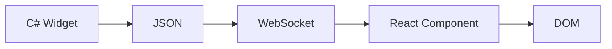

---
searchHints:
  - design system
  - theming
  - colors
  - typography
  - styling
  - ui framework
---

# Framework Design

<Ingress>
Ivy provides a complete UI framework with a modern design system, accessible components, and flexible theming. You write C# code, and Ivy handles rendering a polished, responsive interface.
</Ingress>

For information about the backend C# framework, see [Backend Architecture](./02_BackendArchitecture.md). For details on real-time communication, see [Communication](./03_Communication.md).

## Design Philosophy

Ivy is built around a few core principles:

| Principle | What It Means |
| --- | --- |
| **C# First** | You never write frontend code - all UI is defined in C# |
| **Accessible by Default** | Components use Radix UI primitives with built-in ARIA support |
| **Consistent Design** | A unified design system ensures visual coherence |
| **Themeable** | Full light/dark mode support with customizable color schemes |

The frontend is pre-built and embedded in the framework. In production, you deploy only your C# backend - no npm, no bundling, no frontend build process.

## Ivy Design System

The Ivy Design System provides a complete set of design tokens that ensure visual consistency across all widgets.

### Color Palette

Ivy uses a semantic color system where colors have meaning, not just appearance:

| Token | Purpose | Example Use |
| --- | --- | --- |
| `primary` | Main brand/action color | Buttons, links, focus states |
| `secondary` | Supporting elements | Secondary buttons, badges |
| `destructive` | Dangerous actions | Delete buttons, error states |
| `success` | Positive feedback | Success messages, checkmarks |
| `warning` | Caution states | Warning alerts, pending items |
| `info` | Informational | Info callouts, help text |
| `muted` | De-emphasized content | Placeholder text, disabled states |
| `accent` | Highlights | Hover states, selections |

Each semantic color includes a `-foreground` variant for text that appears on that color (e.g., `primary-foreground` for text on a `primary` background).

### Typography

Ivy uses the [Geist](https://vercel.com/font) font family:

| Font | Use |
| --- | --- |
| **Geist** | UI text, headings, body copy |
| **Geist Mono** | Code blocks, technical content |

Available weights: 400 (regular), 500 (medium), 600 (semibold), 700 (bold).

### Component Library

All Ivy widgets are built on [Radix UI](https://www.radix-ui.com/) primitives, providing:

- **Accessibility**: Full keyboard navigation, screen reader support, ARIA attributes
- **Composition**: Components work together predictably
- **Customization**: Styling via the design system tokens

## Theming

Ivy supports three theme modes out of the box:

```csharp
var client = UseService<IClientProvider>();

// Set theme mode
client.SetThemeMode(ThemeMode.Light);  // Always light
client.SetThemeMode(ThemeMode.Dark);   // Always dark
client.SetThemeMode(ThemeMode.System); // Follow OS preference
```

### Custom Themes

You can customize the entire color palette using `IThemeService`:

```csharp
var themeService = UseService<IThemeService>();
var client = UseService<IClientProvider>();

var customTheme = new Theme
{
    Name = "Ocean",
    Colors = new ThemeColorScheme
    {
        Light = new ThemeColors
        {
            Primary = "#0077BE",
            Background = "#F0F8FF",
            Foreground = "#1A1A1A",
            // ... other colors
        },
        Dark = new ThemeColors
        {
            Primary = "#4A9EFF",
            Background = "#001122",
            Foreground = "#E8F4FD",
            // ... other colors
        }
    }
};

themeService.SetTheme(customTheme);
client.ApplyTheme(themeService.GenerateThemeCss());
```

For complete theming documentation, see [Theming](../../02_Concepts/Theming.md).

## Technology Choices

The UI layer uses carefully selected technologies:

| Technology | Why We Chose It |
| --- | --- |
| **React** | Mature ecosystem, excellent dev tools, concurrent rendering |
| **Radix UI** | Best-in-class accessibility, unstyled primitives |
| **Tailwind CSS** | Consistent utility classes, design token integration |
| **Geist Fonts** | Clean, modern typography designed for interfaces |

These choices are implementation details - you interact only with the C# widget API.

## Additional Resources

- [Theming](../../02_Concepts/Theming.md) - Complete theming guide with examples
- [Widgets](../../02_Concepts/Widgets.md) - Widget system overview
- [Widget Reference](/docs/widgets) - Full widget API documentation

---

## Technical Reference

<Callout variant="Info">
The following section covers internal implementation details for contributors and advanced users. Most Ivy developers don't need this information.
</Callout>

### How Widgets Render

Your C# widgets are serialized to JSON and sent to the frontend via WebSocket. The frontend maps each widget type to a React component:



### Theme System Internals

Themes work via CSS custom properties:

1. Backend generates CSS with `:root` (light) and `.dark` (dark) selectors
2. CSS is injected into the document via SignalR message
3. Theme mode toggles the `dark` class on `<html>`
4. Components read values via Tailwind classes (`bg-primary` → `var(--primary)`)

### State Updates

The framework uses JSON patches for efficient updates:

1. Backend detects state changes in your views
2. Only changed parts are serialized as JSON patches
3. Frontend applies patches to the widget tree
4. React reconciles and updates only affected DOM nodes

