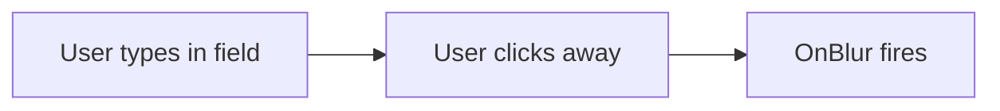

---
searchHints:
  - onblur
  - events
  - focus
  - blur
  - event-handlers
  - input-events
  - form-events
---

# Event Handlers

<Ingress>
Handle user interactions and input events in Ivy with event handlers like OnBlur, enabling validation, data persistence, and reactive user experiences.
</Ingress>

Event handlers allow you to respond to user interactions with widgets in your Ivy applications. They enable you to execute custom logic when users interact with UI elements, such as clicking buttons, changing input values, or moving focus between fields.

## OnBlur Event Handler

The `OnBlur` event handler is triggered when an input widget loses focus. This is particularly useful for validation, auto-saving data, analytics tracking, or performing cleanup operations when a user finishes interacting with a field.

### When OnBlur Fires



The `OnBlur` event fires when:

- User clicks or tabs away from an input field
- User presses Enter in a single-line input
- Focus is programmatically moved to another element
- User clicks outside the input area

### Available on Input Widgets

The `OnBlur` event handler is available on all input widgets that implement the `IAnyInput` interface:

| Input Widget | Description |
|--------------|-------------|
| `TextInput` | Text, password, email, search, and textarea inputs |
| `NumberInput` | Number and slider inputs |
| `SelectInput` | Dropdown select inputs |
| `AsyncSelectInput` | Async dropdown inputs with server-side data |
| `BoolInput` | Checkbox and switch inputs |
| `DateTimeInput` | Date and time picker inputs |
| `DateRangeInput` | Date range picker inputs |
| `FileInput` | File upload inputs |
| `ColorInput` | Color picker inputs |
| `CodeInput` | Code editor inputs |
| `FeedbackInput` | Star rating and feedback inputs |
| `ReadOnlyInput` | Read-only display inputs |

## Basic Usage

The simplest form of `OnBlur` handler performs an action when the input loses focus:

```csharp demo-tabs
public class BasicBlurExample : ViewBase
{
    public override object? Build()
    {
        var name = UseState("");
        var message = UseState("");
        
        return Layout.Vertical()
            | Text.H3("Basic OnBlur Example")
            | name.ToTextInput("Your Name")
                .Placeholder("Enter your name...")
                .HandleBlur(_ => message.Set($"Hello, {name.Value}!"))
            | Text.P(message.Value);
    }
}
```

## HandleBlur Overloads

Ivy provides three overloads of the `HandleBlur` method to accommodate different coding styles:

### 1. ValueTask Handler

For async operations with full event access:

```csharp
textInput.HandleBlur(async (Event<IAnyInput> e) =>
{
    await Task.Delay(100);
    // Access event properties
    Console.WriteLine($"Input blurred: {e.Id}");
    return;
});
```

### 2. Action Handler

For synchronous operations with event access:

```csharp
textInput.HandleBlur((Event<IAnyInput> e) =>
{
    Console.WriteLine($"Input blurred: {e.Id}");
});
```

### 3. Simple Action Handler

For simple operations without event access:

```csharp
textInput.HandleBlur(() =>
{
    Console.WriteLine("Input blurred");
});
```

## Common Use Cases

### Form Validation

Validate input fields when users move to the next field:

```csharp demo-tabs
public class ValidationBlurExample : ViewBase
{
    public override object? Build()
    {
        var email = UseState("");
        var emailError = UseState(() => (string?)null);
        var password = UseState("");
        var passwordError = UseState(() => (string?)null);
        
        var validateEmail = () =>
        {
            if (string.IsNullOrWhiteSpace(email.Value))
            {
                emailError.Set("Email is required");
            }
            else if (!email.Value.Contains("@"))
            {
                emailError.Set("Please enter a valid email address");
            }
            else
            {
                emailError.Set((string?)null);
            }
        };
        
        var validatePassword = () =>
        {
            if (string.IsNullOrWhiteSpace(password.Value))
            {
                passwordError.Set("Password is required");
            }
            else if (password.Value.Length < 8)
            {
                passwordError.Set("Password must be at least 8 characters");
            }
            else
            {
                passwordError.Set((string?)null);
            }
        };
        
        return Layout.Vertical()
            | Text.H3("Validation on Blur")
            | Text.Label("Email")
            | email.ToTextInput()
                .Placeholder("your.email@example.com")
                .HandleBlur(validateEmail)
                .Invalid(emailError.Value)
            | Text.Label("Password")
            | password.ToPasswordInput()
                .Placeholder("Enter password...")
                .HandleBlur(validatePassword)
                .Invalid(passwordError.Value)
            | (emailError.Value == null && passwordError.Value == null && 
               !string.IsNullOrEmpty(email.Value) && !string.IsNullOrEmpty(password.Value)
                ? Text.Muted("Form is valid!").Color(Colors.Green)
                : null);
    }
}
```

### Auto-Save Data

Automatically save input values when users finish editing:

```csharp demo-tabs
public class AutoSaveBlurExample : ViewBase
{
    public override object? Build()
    {
        var title = UseState("");
        var description = UseState("");
        var lastSaved = UseState(() => (DateTime?)null);
        var client = UseService<IClientProvider>();
        
        var autoSave = async () =>
        {
            if (!string.IsNullOrWhiteSpace(title.Value) || !string.IsNullOrWhiteSpace(description.Value))
            {
                // Simulate saving to database
                await Task.Delay(500);
                lastSaved.Set(DateTime.Now);
                client.Toast("Auto-saved!", "Success");
            }
        };
        
        return Layout.Vertical()
            | Text.H3("Auto-Save on Blur")
            | Text.Label("Document Title")
            | title.ToTextInput()
                .Placeholder("Untitled Document")
                .HandleBlur(async () => await autoSave())
            | Text.Label("Description")
            | description.ToTextAreaInput()
                .Placeholder("Enter description...")
                .HandleBlur(async () => await autoSave())
            | (lastSaved.Value != null 
                ? Text.Muted($"Last saved: {lastSaved.Value:HH:mm:ss}")
                : Text.Muted("Not saved yet"));
    }
}
```

### Formatting on Blur

Format input values when users finish editing:

```csharp demo-tabs
public class FormattingBlurExample : ViewBase
{
    public override object? Build()
    {
        var phoneNumber = UseState("");
        var zipCode = UseState("");
        
        var formatPhoneNumber = () =>
        {
            // Remove all non-digit characters
            var digits = new string(phoneNumber.Value.Where(char.IsDigit).ToArray());
            
            if (digits.Length == 10)
            {
                // Format as (XXX) XXX-XXXX
                var formatted = $"({digits.Substring(0, 3)}) {digits.Substring(3, 3)}-{digits.Substring(6, 4)}";
                phoneNumber.Set(formatted);
            }
        };
        
        var formatZipCode = () =>
        {
            // Remove all non-digit characters
            var digits = new string(zipCode.Value.Where(char.IsDigit).ToArray());
            
            if (digits.Length == 5)
            {
                var formatted = digits;
                zipCode.Set(formatted);
            }
            else if (digits.Length == 9)
            {
                // Format as XXXXX-XXXX
                var formatted = $"{digits.Substring(0, 5)}-{digits.Substring(5, 4)}";
                zipCode.Set(formatted);
            }
        };
        
        return Layout.Vertical()
            | Text.H3("Auto-Formatting on Blur")
            | Text.Label("Phone Number")
            | phoneNumber.ToTextInput()
                .Placeholder("Enter 10-digit phone number")
                .HandleBlur(formatPhoneNumber)
            | Text.Label("ZIP Code")
            | zipCode.ToTextInput()
                .Placeholder("Enter 5 or 9-digit ZIP code")
                .HandleBlur(formatZipCode)
            | Text.Muted("Phone and ZIP will auto-format when you finish typing");
    }
}
```

### Analytics Tracking

Track user interactions for analytics:

```csharp demo-tabs
public class AnalyticsBlurExample : ViewBase
{
    public override object? Build()
    {
        var searchQuery = UseState("");
        var interactions = UseState(new List<string>());
        
        var trackInteraction = (string fieldName) =>
        {
            var timestamp = DateTime.Now.ToString("HH:mm:ss");
            var currentInteractions = interactions.Value;
            var newInteractions = currentInteractions.ToList();
            newInteractions.Add($"[{timestamp}] User interacted with {fieldName}");
            interactions.Set(newInteractions);
        };
        
        return Layout.Vertical()
            | Text.H3("Analytics Tracking")
            | searchQuery.ToSearchInput()
                .Placeholder("Search...")
                .HandleBlur(() => trackInteraction("Search Field"))
            | new Separator()
            | Text.H4("Interaction Log:")
            | Layout.Vertical(
                interactions.Value.TakeLast(5).Select(Text.Small)
            );
    }
}
```

### Dependent Field Updates

Update related fields when one field loses focus:

```csharp demo-tabs
public class DependentFieldsBlurExample : ViewBase
{
    public override object? Build()
    {
        var quantity = UseState(1);
        var unitPrice = UseState(10.0m);
        var total = UseState(10.0m);
        var discount = UseState(0.0m);
        var finalTotal = UseState(10.0m);
        
        var calculateTotals = () =>
        {
            var subtotal = quantity.Value * unitPrice.Value;
            total.Set(subtotal);
            
            var discountAmount = subtotal * (discount.Value / 100);
            finalTotal.Set(subtotal - discountAmount);
        };
        
        return new Card(
            Layout.Vertical()
                | Text.H3("Order Calculator")
                | Layout.Grid().Columns(2)
                    | quantity.ToNumberInput("Quantity")
                        .Min(1)
                        .HandleBlur(calculateTotals)
                    | unitPrice.ToNumberInput("Unit Price")
                        .Min(0)
                        .FormatStyle(NumberFormatStyle.Currency)
                        .Currency("USD")
                        .HandleBlur(calculateTotals)
                | discount.ToNumberInput("Discount %")
                    .Min(0)
                    .Max(100)
                    .HandleBlur(calculateTotals)
                | new Separator()
                | Text.Large($"Subtotal: ${total.Value:F2}")
                | Text.Large($"Final Total: ${finalTotal.Value:F2}").Color(Colors.Green)
        ).Title("Dependent Fields Example");
    }
}
```

### Conditional Validation

Show different validation based on other field values:

```csharp demo-tabs
public class ConditionalValidationBlurExample : ViewBase
{
    public override object? Build()
    {
        var accountType = UseState("Personal");
        var companyName = UseState("");
        var taxId = UseState("");
        var companyNameError = UseState(() => (string?)null);
        var taxIdError = UseState(() => (string?)null);
        
        var validateBusinessFields = () =>
        {
            if (accountType.Value == "Business")
            {
                if (string.IsNullOrWhiteSpace(companyName.Value))
                {
                    companyNameError.Set("Company name is required for business accounts");
                }
            else
            {
                companyNameError.Set((string?)null);
            }
                
                if (string.IsNullOrWhiteSpace(taxId.Value))
                {
                    taxIdError.Set("Tax ID is required for business accounts");
                }
                else if (taxId.Value.Length < 9)
                {
                    taxIdError.Set("Tax ID must be at least 9 digits");
                }
                else
                {
                    taxIdError.Set((string?)null);
                }
            }
            else
            {
                companyNameError.Set((string?)null);
                taxIdError.Set((string?)null);
            }
        };
        
        return Layout.Vertical()
            | Text.H3("Conditional Validation")
            | accountType.ToSelectInput(new[] { "Personal", "Business" }.ToOptions(), "Account Type")
            | (accountType.Value == "Business"
                ? Layout.Vertical()
                    | companyName.ToTextInput("Company Name")
                        .Placeholder("Your Company LLC")
                        .HandleBlur(validateBusinessFields)
                        .Invalid(companyNameError.Value)
                    | taxId.ToTextInput("Tax ID")
                        .Placeholder("XX-XXXXXXX")
                        .HandleBlur(validateBusinessFields)
                        .Invalid(taxIdError.Value)
                : null);
    }
}
```

## Advanced Patterns

### Async OnBlur with Loading State

Handle async operations with loading indicators:

```csharp demo-tabs
public class AsyncBlurExample : ViewBase
{
    public override object? Build()
    {
        var username = UseState("");
        var isChecking = UseState(false);
        var availabilityMessage = UseState("");
        
        var checkUsername = async () =>
        {
            if (string.IsNullOrWhiteSpace(username.Value))
            {
                availabilityMessage.Set("");
                return;
            }
            
            isChecking.Set(true);
            availabilityMessage.Set("Checking availability...");
            
            // Simulate API call
            await Task.Delay(1500);
            
            var isAvailable = !username.Value.Equals("admin", StringComparison.OrdinalIgnoreCase) &&
                             !username.Value.Equals("root", StringComparison.OrdinalIgnoreCase);
            
            isChecking.Set(false);
            availabilityMessage.Set(isAvailable 
                ? "✓ Username is available" 
                : "✗ Username is already taken");
        };
        
        return Layout.Vertical()
            | Text.H3("Async Username Check")
            | Text.Label("Username")
            | username.ToTextInput()
                .Placeholder("Choose a username")
                .HandleBlur(async () => await checkUsername())
            | (isChecking.Value 
                ? Text.Muted(availabilityMessage.Value)
                : Text.P(availabilityMessage.Value)
                    .Color(availabilityMessage.Value.StartsWith("✓") ? Colors.Green : Colors.Destructive));
    }
}
```

### Debounced OnBlur

Combine OnBlur with debouncing for better performance:

```csharp demo-tabs
public class DebouncedBlurExample : ViewBase
{
    private CancellationTokenSource? _cts;
    
    public override object? Build()
    {
        var searchTerm = UseState("");
        var searchResults = UseState(new List<string>());
        var isSearching = UseState(false);
        
        var performSearch = async () =>
        {
            if (string.IsNullOrWhiteSpace(searchTerm.Value))
            {
                searchResults.Set(new List<string>());
                return;
            }
            
            // Cancel previous search
            _cts?.Cancel();
            _cts = new CancellationTokenSource();
            
            isSearching.Set(true);
            
            try
            {
                // Simulate API search with debounce
                await Task.Delay(800, _cts.Token);
                
                // Mock search results
                var results = new List<string>
                {
                    $"Result for '{searchTerm.Value}' - Item 1",
                    $"Result for '{searchTerm.Value}' - Item 2",
                    $"Result for '{searchTerm.Value}' - Item 3"
                };
                
                searchResults.Set(results);
            }
            catch (TaskCanceledException)
            {
                // Search was cancelled, ignore
            }
            finally
            {
                isSearching.Set(false);
            }
        };
        
        return Layout.Vertical()
            | Text.H3("Debounced Search")
            | searchTerm.ToSearchInput()
                .Placeholder("Search for items...")
                .HandleBlur(async () => await performSearch())
            | (isSearching.Value 
                ? Text.Muted("Searching...")
                : Layout.Vertical(searchResults.Value.Select(Text.P)));
    }
}
```

### Multi-Field Validation

Validate multiple fields together on blur:

```csharp demo-tabs
public class MultiFieldBlurExample : ViewBase
{
    public override object? Build()
    {
        var password = UseState("");
        var confirmPassword = UseState("");
        var passwordError = UseState(() => (string?)null);
        var confirmError = UseState(() => (string?)null);
        
        var validatePasswords = () =>
        {
            // Validate password
            if (string.IsNullOrWhiteSpace(password.Value))
            {
                passwordError.Set("Password is required");
            }
            else if (password.Value.Length < 8)
            {
                passwordError.Set("Password must be at least 8 characters");
            }
            else
            {
                passwordError.Set((string?)null);
            }
            
            // Validate confirmation
            if (string.IsNullOrWhiteSpace(confirmPassword.Value))
            {
                confirmError.Set("Please confirm your password");
            }
            else if (password.Value != confirmPassword.Value)
            {
                confirmError.Set("Passwords do not match");
            }
            else
            {
                confirmError.Set((string?)null);
            }
        };
        
        return Layout.Vertical()
            | Text.H3("Password Confirmation")
            | Text.Label("Password")
            | password.ToPasswordInput()
                .Placeholder("Enter password")
                .HandleBlur(validatePasswords)
                .Invalid(passwordError.Value)
            | Text.Label("Confirm Password")
            | confirmPassword.ToPasswordInput()
                .Placeholder("Re-enter password")
                .HandleBlur(validatePasswords)
                .Invalid(confirmError.Value)
            | (passwordError.Value == null && confirmError.Value == null && 
               !string.IsNullOrEmpty(password.Value) && !string.IsNullOrEmpty(confirmPassword.Value)
                ? Text.Muted("✓ Passwords match!").Color(Colors.Green)
                : null);
    }
}
```

## Best Practices

### 1. Keep Handlers Lightweight

```csharp
// Good: Quick validation
input.HandleBlur(() =>
{
    if (string.IsNullOrEmpty(value.Value))
        error.Set("Required");
});

// Bad: Heavy computation blocking UI
input.HandleBlur(() =>
{
    var result = PerformExpensiveOperation(); // Avoid synchronous heavy work
    Process(result);
});
```

### 2. Use Async for I/O Operations

```csharp
// Good: Async for API calls
input.HandleBlur(async () =>
{
    await SaveToDatabase(value.Value);
});

// Bad: Blocking I/O
input.HandleBlur(() =>
{
    SaveToDatabase(value.Value).Wait(); // Don't block
});
```

### 3. Provide User Feedback

```csharp
// Good: Show validation state
input.HandleBlur(() =>
{
    error.Set(ValidateEmail(value.Value));
})
.Invalid(error.Value);

// Bad: Silent validation
input.HandleBlur(() =>
{
    ValidateEmail(value.Value); // User doesn't know what happened
});
```

### 4. Don't Abuse OnBlur

```csharp
// Good: OnBlur for validation
emailInput.HandleBlur(() => ValidateEmail());

// Bad: OnBlur for everything (use OnChange for real-time updates)
searchInput.HandleBlur(() => PerformSearch()); // Use OnChange instead
```

### 5. Clean Up Resources

```csharp
// Good: Cancel previous operations
var cts = new CancellationTokenSource();

input.HandleBlur(async () =>
{
    cts?.Cancel();
    cts = new CancellationTokenSource();
    
    try
    {
        await PerformOperation(cts.Token);
    }
    catch (TaskCanceledException) { }
});

// Bad: No cleanup, multiple operations run
input.HandleBlur(async () =>
{
    await PerformOperation(); // Previous operations still running
});
```

## OnBlur vs OnChange

Understanding when to use `OnBlur` versus `OnChange` is important:

| Use Case | OnBlur | OnChange |
|----------|--------|----------|
| Validation after editing complete | ✅ | ❌ |
| Real-time search | ❌ | ✅ |
| Auto-save on field exit | ✅ | ❌ |
| Live character count | ❌ | ✅ |
| Format input after entry | ✅ | ❌ |
| Live form preview | ❌ | ✅ |
| API calls to validate uniqueness | ✅ | ❌ |
| Immediate state synchronization | ❌ | ✅ |

```csharp demo-tabs
public class BlurVsChangeExample : ViewBase
{
    public override object? Build()
    {
        var onChangeValue = UseState("");
        var onBlurValue = UseState("");
        var changeCount = UseState(0);
        var blurCount = UseState(0);
        
        return Layout.Vertical()
            | Text.H3("OnBlur vs OnChange")
            | Layout.Grid().Columns(2)
                | Layout.Vertical()
                    | Text.H4("OnChange")
                    | Text.Muted("Fires on every keystroke")
                    | new TextInput(onChangeValue.Value, e => {
                        onChangeValue.Set(e.Value);
                        changeCount.Set(changeCount.Value + 1);
                    })
                    .Placeholder("Type here...")
                    | Text.P($"Triggered {changeCount.Value} times")
                | Layout.Vertical()
                    | Text.H4("OnBlur")
                    | Text.Muted("Fires when focus is lost")
                    | onBlurValue.ToTextInput()
                        .Placeholder("Type here...")
                        .HandleBlur(() => blurCount.Set(blurCount.Value + 1))
                    | Text.P($"Triggered {blurCount.Value} times");
    }
}
```

## See Also

- [Forms](./Forms.md) - Building forms with validation
- [State](./State.md) - Managing component state
- [Effects](./Effects.md) - Performing side effects
- [Widgets](./Widgets.md) - Understanding Ivy widgets
