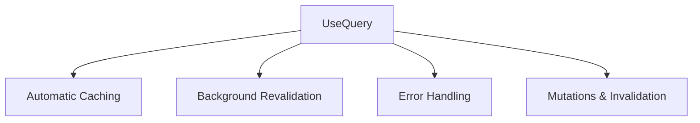
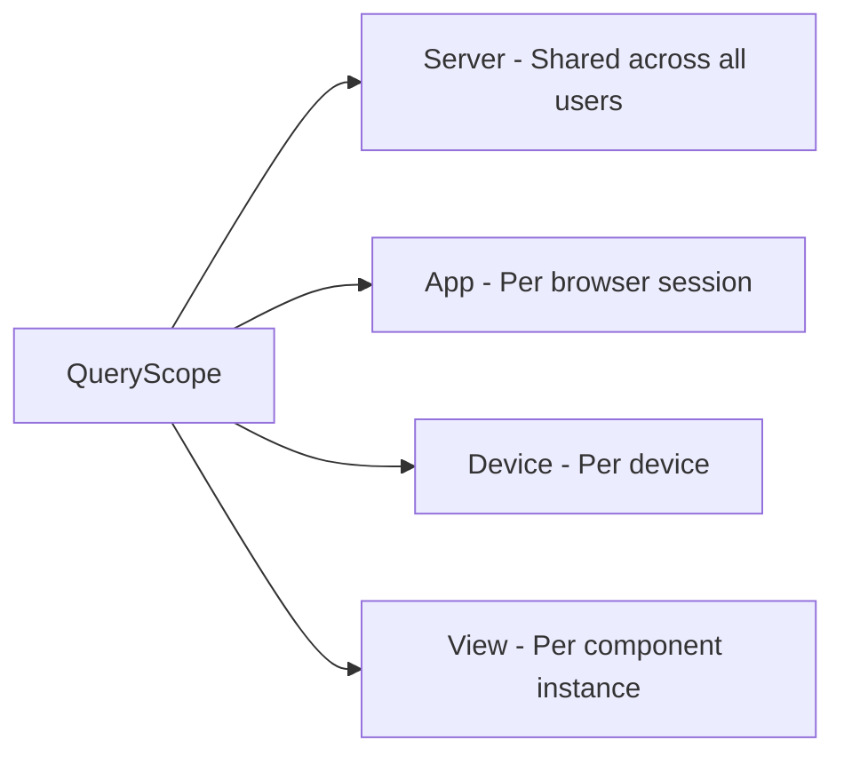

---
searchHints:
  - usequery
  - swr
  - stale-while-revalidate
  - fetch
  - cache
  - async
  - loading
  - revalidate
---

# Query

<Ingress>
Fetch, cache, and synchronize server data with the UseQuery hook - an SWR-style data fetching solution for Ivy [views](./Views.md).
</Ingress>

The `UseQuery` hook provides a powerful way to fetch and cache asynchronous data. Inspired by SWR (stale-while-revalidate), it returns cached data immediately while revalidating in the background, keeping your UI fast and your data fresh.



## Basic Usage

The simplest form of `UseQuery` takes a key and a fetcher function:

```csharp demo-below
public class BasicQueryView : ViewBase
{
    public override object? Build()
    {
        var query = UseQuery(
            key: "user-profile",
            fetcher: async ct =>
            {
                await Task.Delay(1000, ct);
                return new { Name = "Alice", Email = "alice@example.com" };
            });

        if (query.Loading)
            return Text.P("Loading...");

        return Layout.Vertical()
            | Text.H3(query.Value?.Name ?? "")
            | Text.P(query.Value?.Email ?? "");
    }
}
```

## Query Result

`UseQuery` returns a `QueryResult<T>` with the following properties:

| Property | Type | Description |
|----------|------|-------------|
| `Value` | `T?` | The fetched data |
| `Loading` | `bool` | True during initial fetch |
| `Validating` | `bool` | True during background revalidation |
| `Previous` | `bool` | True when showing stale data during key change |
| `Error` | `Exception?` | The error if fetch failed |
| `Mutator` | `QueryMutator<T>` | Methods to mutate the cache |

```csharp demo-tabs
public class QueryResultView : ViewBase
{
    public override object? Build()
    {
        var query = UseQuery(
            key: "data",
            fetcher: async ct =>
            {
                await Task.Delay(1000, ct);
                return $"Fetched at {DateTime.Now:HH:mm:ss}";
            });

        return Layout.Vertical()
            | (query.Loading
                ? Text.Literal("Loading...")
                : Text.Literal(query.Value ?? ""))
            | (query.Validating ? Text.Muted("Revalidating...") : null!)
            | (query.Error is { } err ? Callout.Error(err.Message) : null!)
            | Layout.Horizontal()
                | new Button("Revalidate", _ => query.Mutator.Revalidate())
                    .Variant(ButtonVariant.Outline);
    }
}
```

## Query Options

Configure query behavior with `QueryOptions`:

```csharp
var query = UseQuery(
    key: "data",
    fetcher: FetchData,
    options: new QueryOptions
    {
        Scope = QueryScope.Server,        // Cache scope
        Expiration = TimeSpan.FromMinutes(5), // TTL before revalidation
        KeepPrevious = true,              // Keep previous data during key change
        RefreshInterval = TimeSpan.FromSeconds(30), // Auto-refresh interval
        RevalidateOnInit = true           // Fetch on mount (default: true)
    });
```

## Query Scopes

Control where query data is cached and shared:



| Scope | Description |
|-------|-------------|
| `Server` | Shared across all users (default) |
| `App` | Shared within a browser session |
| `Device` | Shared across sessions on same device |
| `View` | Isolated to component instance, cleaned up on unmount |

```csharp demo-tabs
public class ScopedQueryView : ViewBase
{
    public override object? Build()
    {
        // Server-scoped: shared across all users
        var globalData = UseQuery(
            key: "global-stats",
            fetcher: FetchGlobalStats,
            options: QueryScope.Server);

        // View-scoped: isolated to this component
        var localData = UseQuery(
            key: "local-data",
            fetcher: FetchLocalData,
            options: QueryScope.View);

        return Layout.Vertical()
            | Text.Literal($"Global: {globalData.Value}")
            | Text.Literal($"Local: {localData.Value}");
    }

    private async Task<string> FetchGlobalStats(CancellationToken ct)
    {
        await Task.Delay(500, ct);
        return $"Stats at {DateTime.Now:HH:mm:ss}";
    }

    private async Task<string> FetchLocalData(CancellationToken ct)
    {
        await Task.Delay(500, ct);
        return $"Local at {DateTime.Now:HH:mm:ss}";
    }
}
```

## Conditional Fetching

When the key is `null`, UseQuery returns an idle result without fetching:

```csharp demo-tabs
public class ConditionalQueryView : ViewBase
{
    public override object? Build()
    {
        var shouldFetch = UseState(false);

        var query = UseQuery(
            key: shouldFetch.Value ? "data" : null,
            fetcher: async ct =>
            {
                await Task.Delay(1000, ct);
                return $"Fetched at {DateTime.Now:HH:mm:ss}";
            });

        return Layout.Vertical()
            | shouldFetch.ToBoolInput().Label("Enable fetching")
            | (shouldFetch.Value
                ? query.Loading
                    ? Text.Literal("Loading...")
                    : Text.Literal(query.Value ?? "")
                : Text.Muted("Fetching disabled"));
    }
}
```

## Dependent Fetching

Use a key factory to fetch data that depends on another query:

```csharp demo-tabs
public class DependentQueryView : ViewBase
{
    public override object? Build()
    {
        var user = UseQuery(
            key: "user",
            fetcher: async ct =>
            {
                await Task.Delay(800, ct);
                return new { Id = 42, Name = "Alice" };
            });

        // Only fetches when user is loaded
        var projects = UseQuery(
            () => user.Value?.Id,
            async (userId, ct) =>
            {
                await Task.Delay(800, ct);
                return new[] { $"Project A (user {userId})", $"Project B (user {userId})" };
            });

        return Layout.Vertical()
            | Text.Literal($"User: {(user.Loading ? "Loading..." : user.Value?.Name)}")
            | Text.Literal($"Projects: {(projects.Loading ? "Loading..." : string.Join(", ", projects.Value ?? []))}");
    }
}
```

## Mutations

The `Mutator` provides methods to update cached data:

| Method | Description |
|--------|-------------|
| `Mutate(value, revalidate)` | Update cache with new value |
| `Revalidate()` | Trigger background revalidation |
| `Invalidate()` | Clear cache and refetch |

```csharp demo-tabs
public class MutationView : ViewBase
{
    public override object? Build()
    {
        var query = UseQuery(
            key: "counter",
            fetcher: async ct =>
            {
                await Task.Delay(500, ct);
                return Random.Shared.Next(1, 100);
            });

        if (query.Loading)
            return Text.Literal("Loading...");

        return Layout.Vertical()
            | Text.Literal($"Value: {query.Value}")
            | (query.Validating ? Text.Muted("Syncing...") : null!)
            | Layout.Horizontal()
                | new Button("+10 (Optimistic)", _ =>
                    query.Mutator.Mutate(query.Value + 10, revalidate: true))
                    .Variant(ButtonVariant.Primary)
                | new Button("Set 999", _ =>
                    query.Mutator.Mutate(999, revalidate: false))
                    .Variant(ButtonVariant.Secondary)
                | new Button("Refresh", _ => query.Mutator.Revalidate())
                    .Variant(ButtonVariant.Outline);
    }
}
```

### Cross-Component Mutations

Use `UseMutation` to control a query from a different component:

```csharp demo-tabs
public class SharedDataDisplay : ViewBase
{
    public override object? Build()
    {
        var query = UseQuery(
            key: "shared-data",
            fetcher: async ct =>
            {
                await Task.Delay(500, ct);
                return $"Data: {Guid.NewGuid().ToString()[..8]}";
            });

        return Layout.Horizontal()
            | Text.Literal(query.Loading ? "Loading..." : query.Value ?? "")
            | (query.Validating ? Text.Muted(" (updating...)") : null!);
    }
}

public class SharedDataControls : ViewBase
{
    public override object? Build()
    {
        var mutator = UseMutation("shared-data");

        return Layout.Horizontal()
            | new Button("Revalidate", _ => mutator.Revalidate())
                .Variant(ButtonVariant.Outline)
            | new Button("Invalidate", _ => mutator.Invalidate())
                .Variant(ButtonVariant.Destructive);
    }
}
```

## Tag-Based Invalidation

Assign tags to queries for bulk invalidation:

```csharp demo-tabs
public class TaggedQueriesView : ViewBase
{
    public override object? Build()
    {
        var queryService = UseService<QueryService>();

        var users = UseQuery(
            key: "dashboard/users",
            fetcher: async ct =>
            {
                await Task.Delay(500, ct);
                return $"Users: {Random.Shared.Next(100, 500)}";
            },
            tags: ["dashboard", "users"]);

        var orders = UseQuery(
            key: "dashboard/orders",
            fetcher: async ct =>
            {
                await Task.Delay(500, ct);
                return $"Orders: {Random.Shared.Next(50, 200)}";
            },
            tags: ["dashboard", "orders"]);

        return Layout.Vertical()
            | Text.Literal(users.Loading ? "Loading..." : users.Value ?? "")
            | Text.Literal(orders.Loading ? "Loading..." : orders.Value ?? "")
            | Layout.Horizontal()
                | new Button("Refresh All", _ => queryService.RevalidateByTag("dashboard"))
                    .Variant(ButtonVariant.Primary)
                | new Button("Invalidate All", _ => queryService.InvalidateByTag("dashboard"))
                    .Variant(ButtonVariant.Destructive);
    }
}
```

## Polling

Automatically revalidate at intervals with `RefreshInterval`:

```csharp demo-tabs
public class PollingView : ViewBase
{
    public override object? Build()
    {
        var liveData = UseQuery(
            key: "live-data",
            fetcher: async ct =>
            {
                await Task.Delay(300, ct);
                return new
                {
                    Value = Random.Shared.Next(100, 999),
                    Timestamp = DateTime.Now
                };
            },
            options: new QueryOptions
            {
                RefreshInterval = TimeSpan.FromSeconds(5)
            });

        return Layout.Vertical()
            | Text.Literal($"Value: {liveData.Value?.Value}")
            | Text.Muted($"Updated: {liveData.Value?.Timestamp:HH:mm:ss}")
            | (liveData.Validating ? Text.Muted("Refreshing...") : null!);
    }
}
```

## Pagination

Use `KeepPrevious` to show previous page data while loading the next:

```csharp demo-tabs
public class PaginatedView : ViewBase
{
    public override object? Build()
    {
        var page = UseState(1);

        var items = UseQuery(
            key: $"items?page={page.Value}",
            fetcher: async ct =>
            {
                await Task.Delay(800, ct);
                var start = (page.Value - 1) * 5;
                return Enumerable.Range(start + 1, 5)
                    .Select(i => $"Item {i}")
                    .ToList();
            },
            options: new QueryOptions { KeepPrevious = true });

        return Layout.Vertical()
            | Text.H4($"Page {page.Value}")
            | (items.Previous ? Text.Muted("Loading next page...") : null!)
            | Layout.Vertical(items.Value?.Select(Text.Literal) ?? [])
            | Layout.Horizontal()
                | new Button("Previous", _ => page.Set(p => Math.Max(1, p - 1)))
                    .Disabled(page.Value <= 1)
                    .Variant(ButtonVariant.Outline)
                | new Button("Next", _ => page.Set(p => p + 1))
                    .Variant(ButtonVariant.Outline);
    }
}
```

## Pre-Populated Data

Skip initial fetch when you already have data (e.g., from a list view):

```csharp demo-tabs
public class ProductListView : ViewBase
{
    public override object? Build()
    {
        var products = UseQuery(
            key: "products",
            fetcher: async ct =>
            {
                await Task.Delay(1000, ct);
                return new[]
                {
                    new Product(1, "Widget", 9.99m),
                    new Product(2, "Gadget", 19.99m)
                };
            });

        if (products.Loading)
            return Text.Literal("Loading...");

        return Layout.Vertical(
            products.Value?.Select(p => new ProductDetailView(p))
        );
    }
}

public record Product(int Id, string Name, decimal Price);

public class ProductDetailView(Product initialProduct) : ViewBase
{
    public override object? Build()
    {
        // Use list data immediately, skip initial fetch
        var product = UseQuery(
            key: $"product/{initialProduct.Id}",
            fetcher: ct => FetchProduct(initialProduct.Id, ct),
            options: new QueryOptions { RevalidateOnInit = false },
            initialValue: initialProduct);

        return new Card(
            Layout.Vertical()
            | Text.H4(product.Value?.Name ?? "")
            | Text.Literal($"${product.Value?.Price}")
        );
    }

    private async Task<Product> FetchProduct(int id, CancellationToken ct)
    {
        await Task.Delay(500, ct);
        return new Product(id, "Updated Name", 29.99m);
    }
}
```

## Error Handling

Errors are captured in the `Error` property:

```csharp demo-tabs
public class ErrorHandlingView : ViewBase
{
    public override object? Build()
    {
        var query = UseQuery(
            key: "risky-data",
            fetcher: async ct =>
            {
                await Task.Delay(1000, ct);
                if (Random.Shared.NextDouble() > 0.5)
                    throw new Exception("Network error");
                return "Success!";
            });

        if (query.Loading)
            return Text.Literal("Loading...");

        if (query.Error is { } error)
        {
            return Layout.Vertical()
                | Callout.Error(error.Message)
                | new Button("Retry", _ => query.Mutator.Revalidate())
                    .Variant(ButtonVariant.Outline);
        }

        return Text.Literal(query.Value ?? "");
    }
}
```

## Best Practices

### 1. Use Meaningful Keys

```csharp
// Good: Descriptive, includes parameters
UseQuery(key: $"user/{userId}", fetcher: ...);
UseQuery(key: $"products?category={category}&page={page}", fetcher: ...);

// Bad: Generic or ambiguous
UseQuery(key: "data", fetcher: ...);
UseQuery(key: "1", fetcher: ...);
```

### 2. Choose the Right Scope

```csharp
// Server scope: Global data shared by everyone
UseQuery(key: "exchange-rates", options: QueryScope.Server, ...);

// View scope: Component-specific data with automatic cleanup
UseQuery(key: "form-suggestions", options: QueryScope.View, ...);
```

### 3. Handle Loading States

```csharp
// Good: Graceful loading UI
if (query.Loading)
    return new Skeleton().Height(Size.Units(4));

// Show data with revalidation indicator
return Layout.Vertical()
    | Text.Literal(query.Value ?? "")
    | (query.Validating ? Text.Muted("Updating...") : null!);
```

### 4. Use Tags for Related Queries

```csharp
// Tag related queries for bulk operations
UseQuery(key: "user/profile", tags: ["user"], ...);
UseQuery(key: "user/settings", tags: ["user"], ...);
UseQuery(key: "user/notifications", tags: ["user"], ...);

// Invalidate all user data at once
queryService.InvalidateByTag("user");
```

## See Also

- [State Management](./State.md) - Managing component state
- [Effects](./Effects.md) - Performing side effects
- [Services](./Services.md) - Dependency injection in Ivy
