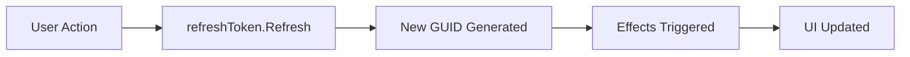

---
searchHints:
  - userefreshtoken
  - refresh
  - reload
  - trigger
  - manual-update
  - reactive
---

# Refresh Tokens

<Ingress>
Refresh tokens provide a mechanism to manually trigger UI updates and effect executions in Ivy, enabling you to reload data, refresh components, or trigger actions on demand.
</Ingress>

Refresh tokens are particularly useful when you need to:

- Manually refresh data after background operations complete
- Reload external content like iframes
- Trigger UI updates from asynchronous processes
- Pass return values between operations and effects



## Basic Usage

The `UseRefreshToken` hook creates a token that can be manually refreshed to trigger updates:

```csharp demo-below
public class BasicRefreshExample : ViewBase
{
    public override object? Build()
    {
        var refreshToken = this.UseRefreshToken();
        var timestamp = UseState(DateTime.Now);
        
        // Effect runs when refresh token changes
        UseEffect(() =>
        {
            timestamp.Set(DateTime.Now);
        }, [refreshToken]);
        
        return Layout.Vertical()
            | Text.Large("Refresh Token Demo")
            | Text.P($"Last refreshed: {timestamp.Value:HH:mm:ss.fff}")
            | new Button("Refresh", onClick: _ => refreshToken.Refresh())
            | Text.Muted("Click the button to manually trigger a refresh");
    }
}
```

## Refresh Tokens as Effect Triggers

Refresh tokens implement `IEffectTriggerConvertible`, making them work seamlessly with the `UseEffect` hook. When you call `refreshToken.Refresh()`, any effects that depend on the refresh token will re-execute:

```csharp demo-tabs
public class EffectTriggerExample : ViewBase
{
    public override object? Build()
    {
        var refreshToken = this.UseRefreshToken();
        var data = UseState<string?>((string?)null);
        var loading = UseState(false);
        
        // Effect runs when refresh token changes
        UseEffect(async () =>
        {
            loading.Set(true);
            
            // Simulate API call
            await Task.Delay(1000);
            data.Set($"Data loaded at {DateTime.Now:HH:mm:ss}");
            
            loading.Set(false);
        }, [refreshToken]);
        
        return Layout.Vertical()
            | Text.Large("Data Fetching with Refresh Token")
            | (loading.Value 
                ? Text.P("Loading...") 
                : Text.P(data.Value ?? "No data yet"))
            | new Button("Reload Data", onClick: _ => refreshToken.Refresh())
                .Icon(Icons.RefreshCw)
                .Disabled(loading.Value);
    }
}
```

## Passing Return Values

Refresh tokens can carry return values that can be accessed in effects. This is useful for passing data from one operation to trigger another:

```csharp demo-below
public class ReturnValueExample : ViewBase
{
    public override object? Build()
    {
        var refreshToken = this.UseRefreshToken();
        var selectedColor = UseState("No color selected");
        
        // Effect responds to refresh token and reads the return value
        UseEffect(() =>
        {
            if (refreshToken.IsRefreshed && refreshToken.ReturnValue is string color)
            {
                selectedColor.Set($"Selected: {color}");
            }
        }, [refreshToken]);
        
        return Layout.Vertical()
            | Text.Large("Return Value Demo")
            | Text.P(selectedColor.Value)
            | Layout.Horizontal(
                new Button("Red", onClick: _ => refreshToken.Refresh("Red")),
                new Button("Green", onClick: _ => refreshToken.Refresh("Green")),
                new Button("Blue", onClick: _ => refreshToken.Refresh("Blue"))
            );
    }
}
```

### Passing Complex Objects

Return values can be any type, including complex objects:

```csharp demo-tabs
public record ProductUpdate(Guid ProductId, string Action, DateTime Timestamp);

public class ComplexReturnValueExample : ViewBase
{
    public override object? Build()
    {
        var refreshToken = this.UseRefreshToken();
        var lastAction = UseState<ProductUpdate?>((ProductUpdate?)null);
        var actionLog = UseState(() => new List<string>());
        
        UseEffect(() =>
        {
            if (refreshToken.IsRefreshed && refreshToken.ReturnValue is ProductUpdate update)
            {
                lastAction.Set(update);
                
                var newLog = new List<string>(actionLog.Value);
                newLog.Add($"{update.Action} on {update.ProductId} at {update.Timestamp:HH:mm:ss}");
                actionLog.Set(newLog);
            }
        }, [refreshToken]);
        
        var productId = Guid.NewGuid();
        
        return Layout.Vertical()
            | Text.Large("Complex Return Values")
            | Layout.Horizontal(
                new Button("Create", onClick: _ => 
                    refreshToken.Refresh(new ProductUpdate(productId, "Created", DateTime.Now))),
                new Button("Update", onClick: _ => 
                    refreshToken.Refresh(new ProductUpdate(productId, "Updated", DateTime.Now))),
                new Button("Delete", onClick: _ => 
                    refreshToken.Refresh(new ProductUpdate(productId, "Deleted", DateTime.Now)))
            )
            | new Separator()
            | (lastAction.Value != null 
                ? Layout.Vertical(
                    Text.P($"Last Action: {lastAction.Value.Action}"),
                    Text.P($"Product ID: {lastAction.Value.ProductId}"),
                    Text.P($"Timestamp: {lastAction.Value.Timestamp:HH:mm:ss}")
                )
                : Text.Muted("No actions yet"))
            | new Separator()
            | Text.H4("Action Log")
            | Layout.Vertical(actionLog.Value.Select(Text.Small));
    }
}
```

## Practical Patterns

### Background Job Completion

Refresh tokens are particularly useful for updating the UI when background jobs or asynchronous operations complete:

```csharp demo-tabs
public class BackgroundJobExample : ViewBase
{
    public override object? Build()
    {
        var refreshToken = this.UseRefreshToken();
        var jobStatus = UseState("Not started");
        var progress = UseState(0);
        var isRunning = UseState(false);
        
        // Monitor the refresh token for job completion
        UseEffect(() =>
        {
            if (refreshToken.IsRefreshed && refreshToken.ReturnValue is int finalProgress)
            {
                progress.Set(finalProgress);
                jobStatus.Set($"Completed at {DateTime.Now:HH:mm:ss}");
                isRunning.Set(false);
            }
        }, [refreshToken]);
        
        async ValueTask StartJob(Event<Button> _)
        {
            isRunning.Set(true);
            jobStatus.Set("Running...");
            progress.Set(0);
            
            // Simulate background job
            await Task.Run(async () =>
            {
                for (int i = 0; i <= 100; i += 10)
                {
                    await Task.Delay(300);
                    progress.Set(i);
                }
                
                // Signal completion with final progress value
                refreshToken.Refresh(100);
            });
        }
        
        return Layout.Vertical()
            | Text.Large("Background Job Example")
            | Text.P($"Status: {jobStatus.Value}")
            | new Progress(value: progress.Value)
            | Text.Literal($"Progress: {progress.Value}%")
            | new Button("Start Job", onClick: StartJob)
                .Icon(Icons.Play)
                .Disabled(isRunning.Value);
    }
}
```

### Master-Detail Data Refresh

Refresh tokens are commonly used in master-detail patterns to refresh the list after creating or editing an item:

```csharp demo-tabs
public class MasterDetailExample : ViewBase
{
    public override object? Build()
    {
        var refreshToken = this.UseRefreshToken();
        var items = UseState(() => new List<string> { "Item 1", "Item 2", "Item 3" });
        var selectedItem = UseState<string?>((string?)null);
        
        // Refresh the list when an item is added/edited
        UseEffect(() =>
        {
            if (refreshToken.IsRefreshed && refreshToken.ReturnValue is string newItem)
            {
                var newList = new List<string>(items.Value);
                
                if (selectedItem.Value != null && newList.Contains(selectedItem.Value))
                {
                    // Update existing item
                    var index = newList.IndexOf(selectedItem.Value);
                    newList[index] = newItem;
                }
                else
                {
                    // Add new item
                    newList.Add(newItem);
                }
                
                items.Set(newList);
                selectedItem.Set(newItem);
            }
        }, [refreshToken]);
        
        return Layout.Horizontal()
            | new Card(
                Layout.Vertical()
                    | Text.H4("Items")
                    | Layout.Vertical(items.Value.Select(item =>
                        new Button(item, onClick: _ => selectedItem.Set(item))
                            .Variant(item == selectedItem.Value 
                                ? ButtonVariant.Primary 
                                : ButtonVariant.Ghost)
                            .Width(Size.Full())
                    ))
                    | new Button("Add New", onClick: _ => 
                        refreshToken.Refresh($"Item {items.Value.Count + 1}"))
                        .Icon(Icons.Plus)
                        .Width(Size.Full())
            )
            | new Card(
                selectedItem.Value != null
                    ? Layout.Vertical()
                        | Text.H4("Edit Item")
                        | Text.P($"Editing: {selectedItem.Value}")
                        | new Button("Save Changes", onClick: _ =>
                            refreshToken.Refresh($"{selectedItem.Value} (edited)"))
                            .Icon(Icons.Save)
                    : Text.Muted("Select an item to edit")
            );
    }
}
```

### Refreshing External Content

Refresh tokens can force external content like iframes to reload:

```csharp demo-tabs
public class IframeRefreshExample : ViewBase
{
    public override object? Build()
    {
        var refreshToken = this.UseRefreshToken();
        var url = UseState("https://example.com");
        var refreshCount = UseState(0);
        
        UseEffect(() =>
        {
            if (refreshToken.IsRefreshed)
            {
                refreshCount.Set(refreshCount.Value + 1);
            }
        }, [refreshToken]);
        
        return Layout.Vertical()
            | Text.Large("Iframe Refresh Example")
            | Layout.Horizontal()
                .Gap(2)
                | url.ToTextInput("URL").Placeholder("Enter URL")
                | new Button("Reload", onClick: _ => refreshToken.Refresh())
                    .Icon(Icons.RefreshCw)
            | Text.Small($"Refreshed {refreshCount.Value} times")
            | new Iframe(url.Value, refreshToken.Token.GetHashCode())
                .Width(Size.Full())
                .Height(Size.Units(60));
    }
}
```

## Multiple Refresh Triggers

You can combine refresh tokens with other effect triggers to create sophisticated update patterns:

```csharp demo-tabs
public class MultipleTriggersExample : ViewBase
{
    public override object? Build()
    {
        var refreshToken = this.UseRefreshToken();
        var autoRefresh = UseState(false);
        var data = UseState($"Initial load: {DateTime.Now:HH:mm:ss}");
        
        // Trigger on both refresh token AND auto-refresh toggle
        UseEffect(async () =>
        {
            data.Set($"Loaded: {DateTime.Now:HH:mm:ss}");
            
            if (autoRefresh.Value)
            {
                await Task.Delay(5000);
                refreshToken.Refresh();
            }
        }, [refreshToken, autoRefresh]);
        
        return Layout.Vertical()
            | Text.Large("Multiple Triggers")
            | Text.P(data.Value)
            | Layout.Horizontal(
                new Button("Manual Refresh", onClick: _ => refreshToken.Refresh())
                    .Icon(Icons.RefreshCw)
                    .Disabled(autoRefresh.Value),
                autoRefresh.ToBoolInput("Auto-refresh every 5s")
                    .Width(Size.Grow())
            );
    }
}
```

## Understanding Token Properties

The `RefreshToken` class provides several useful properties:

```csharp
public class RefreshTokenPropertiesExample : ViewBase
{
    public override object? Build()
    {
        var refreshToken = this.UseRefreshToken();
        var tokenInfo = UseState("");
        
        UseEffect(() =>
        {
            var info = $@"Token: {refreshToken.Token}
IsRefreshed: {refreshToken.IsRefreshed}
ReturnValue: {refreshToken.ReturnValue?.ToString() ?? "null"}
Timestamp: {DateTime.Now:HH:mm:ss.fff}";
            
            tokenInfo.Set(info);
        }, [refreshToken]);
        
        return Layout.Vertical()
            | Text.Large("Token Properties")
            | new Button("Refresh with Value", 
                onClick: _ => refreshToken.Refresh("Custom Value"))
            | new Button("Refresh without Value", 
                onClick: _ => refreshToken.Refresh())
            | new Card(
                Text.Code(tokenInfo.Value)
            );
    }
}
```

### Token Property Reference

| Property | Type | Description |
|----------|------|-------------|
| `Token` | `Guid` | A unique identifier that changes with each refresh |
| `IsRefreshed` | `bool` | `true` if the token has been refreshed at least once |
| `ReturnValue` | `object?` | The value passed to the last `Refresh()` call |

## Best Practices

### 1. Use Return Values for Data Flow

```csharp
// Good: Pass important data through return values
refreshToken.Refresh(newProductId);

// Effect can then use this value
UseEffect(() =>
{
    if (refreshToken.ReturnValue is Guid productId)
    {
        // Navigate to or load the new product
    }
}, [refreshToken]);

// Less ideal: Using separate state
var productId = UseState<Guid?>((Guid?)null);
productId.Set(newProductId);
refreshToken.Refresh();
```

### 2. Combine with AfterInit Trigger

```csharp
// Good: Load data on init AND when manually refreshed
UseEffect(async () =>
{
    var data = await LoadData();
    // ...
}, [EffectTrigger.AfterInit(), refreshToken]);

// Less flexible: Only manual refresh
UseEffect(async () =>
{
    var data = await LoadData();
    // ...
}, [refreshToken]); // Doesn't run on initialization
```

### 3. Guard Against Unnecessary Refreshes

```csharp
// Good: Check IsRefreshed to avoid running on initial render
UseEffect(() =>
{
    if (refreshToken.IsRefreshed)
    {
        // Only run after an actual refresh, not on initial mount
        ShowNotification("Data refreshed!");
    }
}, [refreshToken]);

// Less ideal: Runs even when not explicitly refreshed
UseEffect(() =>
{
    ShowNotification("Data refreshed!"); // Shows on mount too
}, [refreshToken]);
```

### 4. Name Tokens Descriptively

```csharp
// Good: Clear purpose
var dataRefreshToken = this.UseRefreshToken();
var formSubmitToken = this.UseRefreshToken();

// Less clear: Generic names
var token1 = this.UseRefreshToken();
var token2 = this.UseRefreshToken();
```

## Common Patterns

### Polling with Manual Refresh

```csharp demo-tabs
public class PollingExample : ViewBase
{
    public override object? Build()
    {
        var refreshToken = this.UseRefreshToken();
        var isPolling = UseState(false);
        var data = UseState("No data");
        var pollCount = UseState(0);
        
        UseEffect(async () =>
        {
            // Fetch data
            await Task.Delay(500);
            data.Set($"Poll #{pollCount.Value + 1}: {DateTime.Now:HH:mm:ss}");
            pollCount.Set(pollCount.Value + 1);
            
            // Continue polling if enabled
            if (isPolling.Value)
            {
                await Task.Delay(2000);
                refreshToken.Refresh();
            }
        }, [refreshToken, isPolling]);
        
        return Layout.Vertical()
            | Text.Large("Polling Example")
            | Text.P(data.Value)
            | Layout.Horizontal(
                new Button(isPolling.Value ? "Stop Polling" : "Start Polling",
                    onClick: _ => isPolling.Set(!isPolling.Value))
                    .Icon(isPolling.Value ? Icons.Pause : Icons.Play),
                new Button("Manual Refresh", onClick: _ => refreshToken.Refresh())
                    .Icon(Icons.RefreshCw)
                    .Disabled(isPolling.Value)
            );
    }
}
```

### Conditional Refresh

```csharp demo-tabs
public class ConditionalRefreshExample : ViewBase
{
    public override object? Build()
    {
        var refreshToken = this.UseRefreshToken();
        var condition = UseState(true);
        var refreshCount = UseState(0);
        var message = UseState("Ready");
        
        UseEffect(() =>
        {
            if (!refreshToken.IsRefreshed)
            {
                return; // Skip on initial render
            }
            
            if (condition.Value)
            {
                refreshCount.Set(refreshCount.Value + 1);
                message.Set($"Refreshed: {DateTime.Now:HH:mm:ss}");
            }
            else
            {
                message.Set("Refresh blocked by condition");
            }
        }, [refreshToken]);
        
        return Layout.Vertical()
            | Text.Large("Conditional Refresh")
            | Text.P($"Message: {message.Value}")
            | Text.P($"Successful refreshes: {refreshCount.Value}")
            | Layout.Horizontal(
                condition.ToBoolInput("Allow Refresh"),
                new Button("Attempt Refresh", onClick: _ => refreshToken.Refresh())
                    .Icon(Icons.RefreshCw)
            );
    }
}
```

## See Also

- [Effects](./Effects.md) - Learn about the UseEffect hook
- [State Management](./State.md) - Managing component state
- [Signals](./Signals.md) - Cross-component communication
