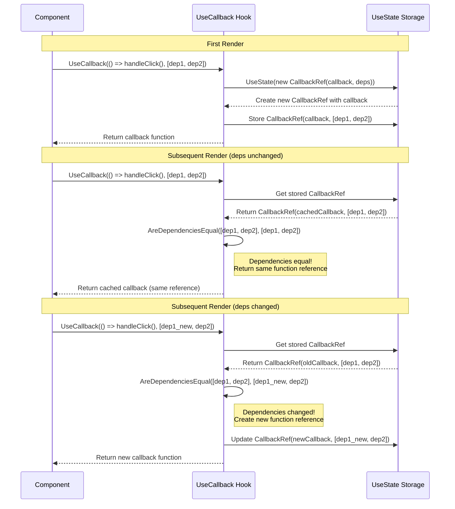

# UseCallback

The `UseCallback` hook memoizes callback functions, preventing unnecessary re-renders when the callback is passed as a prop to child components.

<Callout type="Tip">
`UseCallback` memoizes the function reference itself, while `UseMemo` memoizes the result of calling a function. The memoized callback is only executed when you invoke it.
</Callout>

### How UseCallback Works



### Basic UseCallback Usage

```csharp
public class ParentView : ViewBase
{
    public override object? Build()
    {
        var count = UseState(0);
        var multiplier = UseState(2);
        
        // Memoize the callback to prevent child re-renders
        var handleIncrement = UseCallback(() => 
        {
            count.Set(count.Value + 1);
        }, count); // Only recreate when count changes
        
        var handleReset = UseCallback(() => 
        {
            count.Set(0);
        }); // No dependencies - callback never changes
        
        return Layout.Vertical(
            Text.Inline($"Count: {count.Value}"),
            new ChildComponent(handleIncrement, handleReset),
            new NumberInput("Multiplier", multiplier.Value, v => multiplier.Set(v))
        );
    }
}
```

### When to Use UseCallback

Use `UseCallback` when:

- **Passing callbacks to child components** - Prevents unnecessary re-renders
- **Callbacks are dependencies of other hooks** - Ensures stable references
- **Event handlers with expensive setup** - Avoids recreating handlers on every render

### UseCallback Examples

#### Preventing Child Re-renders

```csharp
public class TodoListView : ViewBase
{
    public override object? Build()
    {
        var todos = UseState(new List<Todo>());
        var filter = UseState("");
        
        // Memoize callbacks to prevent TodoItem re-renders
        var handleToggle = UseCallback((int id) => 
        {
            todos.Set(todos.Value.Select(t => 
                t.Id == id ? t with { Completed = !t.Completed } : t
            ).ToList());
        }, todos);
        
        var handleDelete = UseCallback((int id) => 
        {
            todos.Set(todos.Value.Where(t => t.Id != id).ToList());
        }, todos);
        
        var filteredTodos = UseMemo(() => 
            todos.Value.Where(t => 
                t.Title.Contains(filter.Value, StringComparison.OrdinalIgnoreCase)
            ).ToList(),
            todos, filter
        );
        
        return Layout.Vertical(
            new TextInput("Filter", filter.Value, v => filter.Set(v)),
            Layout.Vertical(
                filteredTodos.Select(todo => 
                    new TodoItem(todo, handleToggle, handleDelete).Key(todo.Id)
                )
            )
        );
    }
}
```

#### Stable Dependencies for [Effects](../../04_Hooks/04_Effect.md)

```csharp
public class DataFetcherView : ViewBase
{
    public override object? Build()
    {
        var data = UseState<List<Item>?>(null);
        var loading = UseState(false);
        var searchTerm = UseState("");
        
        // Memoize the fetch function
        var fetchData = UseCallback(async () => 
        {
            loading.Set(true);
            try
            {
                var result = await ApiService.SearchItems(searchTerm.Value);
                data.Set(result);
            }
            finally
            {
                loading.Set(false);
            }
        }, searchTerm);
        
        // Use the memoized callback in an effect
        UseEffect(async () => 
        {
            await fetchData();
        }, fetchData); // Stable dependency prevents infinite loops
        
        return Layout.Vertical(
            new TextInput("Search", searchTerm.Value, v => searchTerm.Set(v)),
            loading.Value ? new Loading() : new ItemList(data.Value ?? new List<Item>())
        );
    }
}
```
