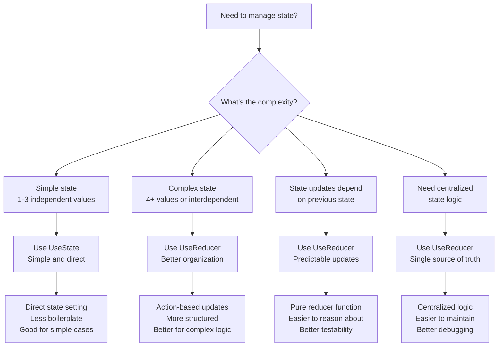
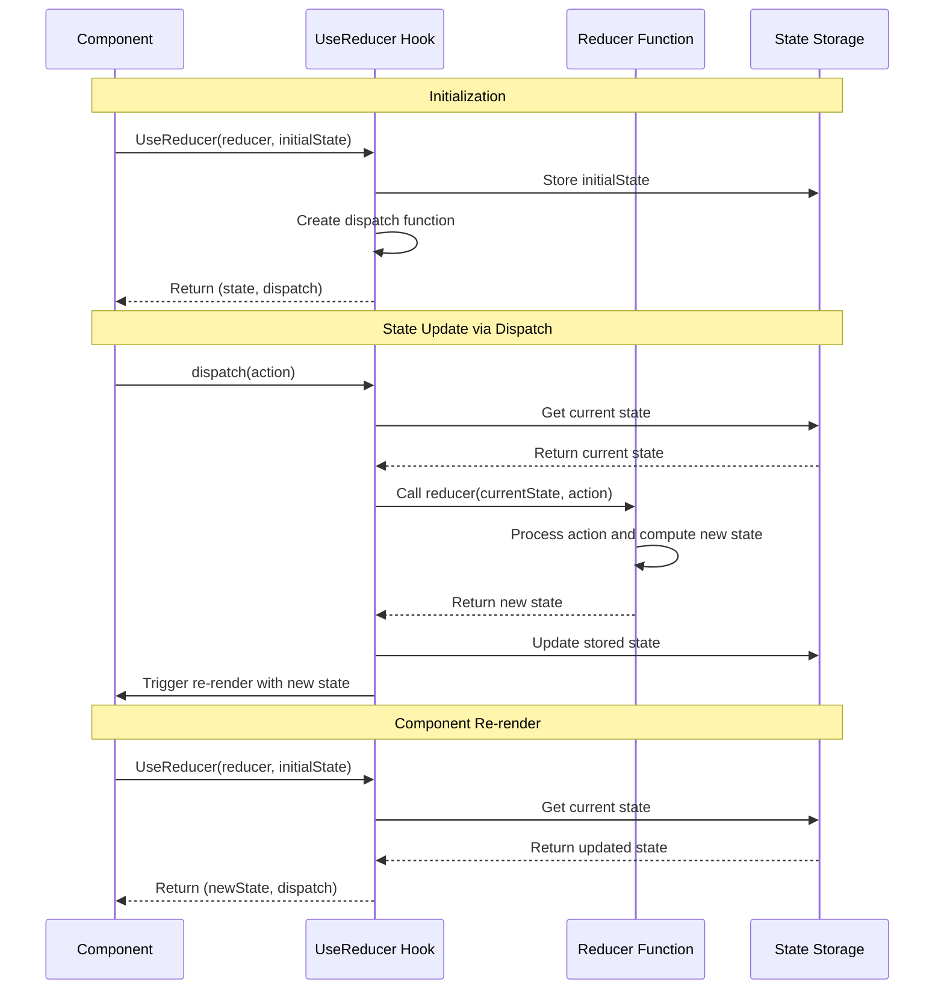
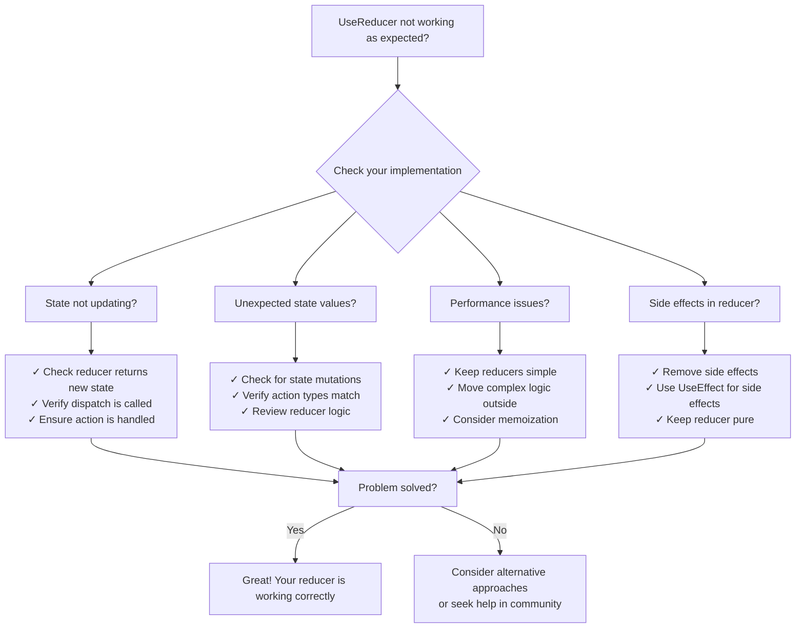

---
searchHints:
  - usereducer
  - reducer
  - state-management
  - complex-state
  - actions
  - hooks
  - state-updates
  - predictable-state
---

# Reducers

<Ingress>
Manage complex state logic with reducers, providing a predictable state management pattern for components with multiple sub-values or interdependent state updates.
</Ingress>

## Overview

The `UseReducer` hook is an alternative to `UseState` that is better suited for managing complex state logic. It follows the reducer pattern where state updates are handled by a pure function.

Key benefits of `UseReducer`:

- **Predictable State Updates** - All state changes go through a single reducer function
- **Complex State Logic** - Better suited for state with multiple sub-values or interdependent updates
- **Action-Based Updates** - State changes are explicit and traceable through actions
- **Testability** - Pure reducer functions are easy to test in isolation

<Callout type="Tip">
`UseReducer` is ideal when you have complex state logic involving multiple sub-values, when the next state depends on the previous one, or when you want to centralize state update logic in one place.
</Callout>

## When to Use UseReducer



## UseReducer Hook

The `UseReducer` hook manages state through a reducer function that takes the current state and an action, returning the new state.

<Callout type="Tip">
Reducers should be pure functions - they should not have side effects and should return a new state object rather than mutating the existing one.
</Callout>

### How UseReducer Works



### Basic Usage

```csharp
public class BasicReducerDemo : ViewBase
{
    // Reducer function
    private int CounterReducer(int state, string action) => action switch
    {
        "increment" => state + 1,
        "decrement" => state - 1,
        "reset" => 0,
        _ => state
    };
    
    public override object? Build()
    {
        var (count, dispatch) = UseReducer(CounterReducer, 0);
        
        return Layout.Vertical(
            Text.H3($"Count: {count.Value}"),
            Layout.Horizontal(
                new Button("-", _ => dispatch("decrement")),
                new Button("Reset", _ => dispatch("reset")),
                new Button("+", _ => dispatch("increment"))
            )
        );
    }
}
```

### Use Cases

Use `UseReducer` when:

- **Complex State Logic** - Managing state with multiple sub-values or interdependent properties
- **State Updates Depend on Previous State** - When the next state depends on the previous state value
- **Action-Based Updates** - When you want explicit, traceable state changes through actions
- **Centralized State Logic** - When you want to centralize all state update logic in one place
- **Better Testability** - When you need to test state logic in isolation

### UseReducer vs UseState

Choose between `UseReducer` and `UseState` based on complexity:

| UseState | UseReducer |
|----------|------------|
| Simple state updates | Complex state logic |
| Independent values | Interdependent values |
| Direct state setting | Action-based updates |
| Less boilerplate | More structured |
| Good for 1-3 values | Good for 4+ values |

### Best Practices

- **Keep Reducers Pure** - Reducers should not have side effects and should return new state objects
- **Use Immutable Updates** - Always return new state objects rather than mutating existing ones
- **Handle All Action Types** - Include a default case to handle unknown actions gracefully
- **Type Safety** - Use strongly-typed actions and state for better compile-time safety
- **Extract Complex Logic** - Move complex reducer logic into separate functions for clarity

### Examples

#### Complex State Logic

```csharp
public class ComplexStateDemo : ViewBase
{
    record TodoState(List<string> Items, int CompletedCount, string Filter);
    
    private TodoState TodoReducer(TodoState state, (string Action, string? Value) action) =>
        action.Action switch
        {
            "add" => state with { Items = state.Items.Append(action.Value!).ToList() },
            "remove" => state with { Items = state.Items.Where(x => x != action.Value).ToList() },
            "complete" => state with { CompletedCount = state.CompletedCount + 1 },
            "setFilter" => state with { Filter = action.Value ?? "" },
            "clearCompleted" => state with 
            { 
                Items = state.Items.Where(x => !x.StartsWith("[X]")).ToList(),
                CompletedCount = 0
            },
            _ => state
        };
    
    public override object? Build()
    {
        var (state, dispatch) = UseReducer(TodoReducer, new TodoState(new List<string>(), 0, ""));
        var newTodo = UseState("");
        
        var filteredItems = UseMemo(() => 
            state.Value.Items.Where(item => 
                item.Contains(state.Value.Filter, StringComparison.OrdinalIgnoreCase)
            ).ToList(),
            state
        );
        
        return Layout.Vertical(
            Layout.Horizontal(
                newTodo.ToTextInput().Placeholder("New todo..."),
                new Button("Add", _ =>
                {
                    if (!string.IsNullOrWhiteSpace(newTodo.Value))
                    {
                        dispatch(("add", newTodo.Value));
                        newTodo.Set("");
                    }
                })
            ),
            new TextInput("Filter", state.Value.Filter, v => dispatch(("setFilter", v))),
            filteredItems.Select(item =>
                Layout.Horizontal(
                    Text.P(item),
                    new Button("Complete", _ => dispatch(("complete", null))),
                    new Button("Remove", _ => dispatch(("remove", item)))
                )),
            Text.P($"Completed: {state.Value.CompletedCount}"),
            new Button("Clear Completed", _ => dispatch(("clearCompleted", null)))
        );
    }
}
```

#### Form State Management

```csharp
public class FormStateDemo : ViewBase
{
    record FormState(string Name, string Email, bool IsValid, List<string> Errors);
    
    private FormState FormReducer(FormState state, (string Field, string? Value) action) =>
        action.Field switch
        {
            "setName" => ValidateForm(state with { Name = action.Value ?? "" }),
            "setEmail" => ValidateForm(state with { Email = action.Value ?? "" }),
            "reset" => new FormState("", "", false, new List<string>()),
            _ => state
        };
    
    private FormState ValidateForm(FormState state)
    {
        var errors = new List<string>();
        
        if (string.IsNullOrWhiteSpace(state.Name))
            errors.Add("Name is required");
        
        if (string.IsNullOrWhiteSpace(state.Email))
            errors.Add("Email is required");
        else if (!state.Email.Contains("@"))
            errors.Add("Email is invalid");
        
        return state with 
        { 
            IsValid = errors.Count == 0,
            Errors = errors
        };
    }
    
    public override object? Build()
    {
        var (formState, dispatch) = UseReducer(FormReducer, new FormState("", "", false, new List<string>()));
        
        return Layout.Vertical(
            new TextInput("Name", formState.Value.Name, v => dispatch(("setName", v))),
            new TextInput("Email", formState.Value.Email, v => dispatch(("setEmail", v))),
            formState.Value.Errors.Select(error => Text.Small(error, color: "red")),
            new Button("Submit", _ => { /* Submit logic */ }, disabled: !formState.Value.IsValid),
            new Button("Reset", _ => dispatch(("reset", null)))
        );
    }
}
```

## Performance Considerations

### State Update Efficiency

- **Immutable Updates**: Creating new state objects has a small overhead, but enables better change detection and prevents bugs:

```csharp
// Good: Immutable update with records
record State(List<int> Items);
private State Reducer(State state, string action) => action switch
{
    "add" => state with { Items = state.Items.Append(1).ToList() },
    _ => state
};

// Consider: For very large lists, consider more efficient update strategies
```

- **Reducer Complexity**: Keep reducer logic simple and fast. Move complex computations outside the reducer:

```csharp
// Good: Simple reducer, complex logic outside
private State Reducer(State state, Action action) => action switch
{
    "update" => state with { Data = action.Data },
    _ => state
};

// Bad: Complex computation in reducer
private State Reducer(State state, Action action) => action switch
{
    "process" => state with { 
        ProcessedData = state.RawData.SelectMany(/* complex transformation */).ToList() 
    },
    _ => state
};
```

- **Action Object Creation**: Consider the overhead of creating action objects:

```csharp
// Good: Simple action types
dispatch("increment");
dispatch(("add", item));

// Consider: For high-frequency updates, use value types or simple types
```

### When NOT to Use UseReducer

- **Simple State**: Don't use `UseReducer` for simple state that can be managed with `UseState`
- **Independent Values**: If state values are independent, `UseState` is more appropriate
- **No Complex Logic**: If state updates are straightforward, `UseReducer` adds unnecessary complexity

```csharp
// Unnecessary: Simple state doesn't need reducer
var (count, dispatch) = UseReducer((s, a) => a == "inc" ? s + 1 : s, 0);

// Better: Use UseState for simple cases
var count = UseState(0);
```

## Common Pitfalls and Solutions

### Reducer Troubleshooting Guide



### 1. Mutating State

**Problem**: Mutating state directly instead of returning new state

```csharp
// Wrong: Mutating state directly
private State Reducer(State state, Action action)
{
    if (action == "add")
    {
        state.Items.Add(newItem); // Mutation!
        return state;
    }
    return state;
}
```

**Solution**: Always return new state objects

```csharp
// Correct: Return new state
private State Reducer(State state, Action action) => action switch
{
    "add" => state with { Items = state.Items.Append(newItem).ToList() },
    _ => state
};
```

### 2. Side Effects in Reducer

**Problem**: Performing side effects inside the reducer function

```csharp
// Wrong: Side effects in reducer
private State Reducer(State state, Action action)
{
    if (action == "save")
    {
        SaveToDatabase(state); // Side effect!
        return state;
    }
    return state;
}
```

**Solution**: Use `UseEffect` for side effects

```csharp
// Correct: Pure reducer
private State Reducer(State state, Action action) => action switch
{
    "save" => state with { ShouldSave = true },
    _ => state
};

// Handle side effects in component
UseEffect(() => 
{
    if (state.Value.ShouldSave)
    {
        SaveToDatabase(state.Value);
        dispatch(("saved", null));
    }
}, state.Value.ShouldSave);
```

### 3. Not Handling All Actions

**Problem**: Missing default case or not handling all action types

```csharp
// Wrong: No default case
private State Reducer(State state, Action action) => action switch
{
    "increment" => state with { Count = state.Count + 1 },
    "decrement" => state with { Count = state.Count - 1 }
    // Missing default case!
};
```

**Solution**: Always include a default case

```csharp
// Correct: Default case handles unknown actions
private State Reducer(State state, Action action) => action switch
{
    "increment" => state with { Count = state.Count + 1 },
    "decrement" => state with { Count = state.Count - 1 },
    _ => state // Return current state for unknown actions
};
```

### 4. Complex Logic in Reducer

**Problem**: Putting too much complex logic inside the reducer

```csharp
// Wrong: Complex computation in reducer
private State Reducer(State state, Action action) => action switch
{
    "process" => state with 
    { 
        Result = state.Data
            .Where(x => x.IsValid)
            .GroupBy(x => x.Category)
            .Select(g => new { Category = g.Key, Count = g.Count(), Total = g.Sum(x => x.Value) })
            .OrderByDescending(x => x.Total)
            .Take(10)
            .ToList()
    },
    _ => state
};
```

**Solution**: Extract complex logic to separate functions

```csharp
// Correct: Extract complex logic
private List<ProcessedItem> ProcessData(List<DataItem> data)
{
    return data
        .Where(x => x.IsValid)
        .GroupBy(x => x.Category)
        .Select(g => new ProcessedItem(g.Key, g.Count(), g.Sum(x => x.Value)))
        .OrderByDescending(x => x.Total)
        .Take(10)
        .ToList();
}

private State Reducer(State state, Action action) => action switch
{
    "process" => state with { Result = ProcessData(state.Data) },
    _ => state
};
```

### 5. Forgetting to Update Related State

**Problem**: Updating one part of state but forgetting related parts

```csharp
// Wrong: Incomplete state update
private State Reducer(State state, Action action) => action switch
{
    "addItem" => state with { Items = state.Items.Append(newItem).ToList() },
    // Forgot to update count!
    _ => state
};
```

**Solution**: Update all related state properties

```csharp
// Correct: Update all related state
private State Reducer(State state, Action action) => action switch
{
    "addItem" => state with 
    { 
        Items = state.Items.Append(newItem).ToList(),
        Count = state.Count + 1,
        LastUpdated = DateTime.Now
    },
    _ => state
};
```

### 6. Using Wrong Action Types

**Problem**: Dispatching actions that don't match the reducer's expected types

```csharp
// Wrong: Action type mismatch
var (state, dispatch) = UseReducer(Reducer, initialState);
dispatch(123); // Reducer expects string actions!

private State Reducer(State state, string action) => action switch
{
    "increment" => state with { Count = state.Count + 1 },
    _ => state
};
```

**Solution**: Use strongly-typed actions

```csharp
// Correct: Strongly-typed actions
record IncrementAction();
record DecrementAction();
record AddItemAction(string Item);

var (state, dispatch) = UseReducer(Reducer, initialState);
dispatch(new IncrementAction());

private State Reducer(State state, object action) => action switch
{
    IncrementAction => state with { Count = state.Count + 1 },
    DecrementAction => state with { Count = state.Count - 1 },
    AddItemAction a => state with { Items = state.Items.Append(a.Item).ToList() },
    _ => state
};
```

## See Also

- [State Management](../../04_Hooks/03_State.md) - Simple state management with UseState
- [Effects](../../04_Hooks/04_Effect.md) - Side effects and async operations
- [Memoization](../../04_Hooks/05_Memo.md) - Performance optimization
- [Callbacks](../../04_Hooks/06_Callback.md) - Memoized callback functions
