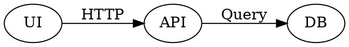

# Ivy Framework Weekly Notes - Week of 2026-04-07

> [!NOTE]
> We usually release on Fridays every week. Sign up on [https://ivy.app/](https://ivy.app/auth/sign-up) to get release notes directly to your inbox.

This release covers Ivy Framework changes from late March through early April 2026. Updates that belong only to Tendril apps or internal plan tooling are omitted. Bug fixes focus on server, .NET, and build issues; routine frontend-only fixes are not listed exhaustively.

The C# snippets below follow real samples under `src/Ivy.Samples.Shared` (file names in parentheses) so you can open the full app for context.

## Charts

### Dual-axis and axis generation

Bar, Line, Area, and [Scatter](https://docs.ivy.app/widgets/charts/scatter-chart) series support `YAxisIndex` for dual-axis layouts. `generateYAxis` was refined for multi-axis charts (including skipping `largeSpread` when multiple axes are active). Cartesian charts reclaim plot width when X axes are hidden, and grid padding was tuned so hidden axes do not waste space.

Dual-axis bar chart (`BarChartApp.cs`, `BarChart10`):

```csharp
var data = new[]
{
    new { Month = "Jan", Revenue = 4500, GrowthRate = 5 },
    new { Month = "Feb", Revenue = 5200, GrowthRate = 15 },
    // ...
};

return new Card().Title("Dual Axis (Revenue vs Growth Rate)")
    | new BarChart(data)
        .ColorScheme(ColorScheme.Default)
        .Bar(new Bar("Revenue", 1).YAxisIndex(0).Radius(8).LegendType(LegendTypes.Square))
        .Bar(new Bar("GrowthRate", 2).YAxisIndex(1).Radius(8).LegendType(LegendTypes.Square))
        .CartesianGrid(new CartesianGrid().Horizontal())
        .Tooltip()
        .XAxis(new XAxis("Month").TickLine(false).AxisLine(false))
        .YAxis(new YAxis("Revenue")
            .Orientation(YAxis.Orientations.Left)
            .TickFormatter("C0"))
        .YAxis(new YAxis("GrowthRate")
            .Orientation(YAxis.Orientations.Right)
            .TickFormatter("P0")
            .Domain(-0.1, 0.2))
        .Legend();
```

### Bar chart

BarChart vertical bar orientation and ECharts axis pairing were corrected. `YAxis.Hide` is honored reliably, and grid padding behaves correctly with hidden axes. Documentation describes the `YAxisIndex` pattern on `Bar` records and dual-axis setups.

### Scatter chart

Scatter avoids category axes where a value axis is required. [ScatterChartApp](https://docs.ivy.app/widgets/charts/scatter-chart) includes a dual-axis sample; the sample uses a numeric X axis (not category) for continuous data. Widget tests cover ScatterChart, and the implementation blocks inappropriate category axis typing for scatter data.

Dual-axis scatter (`ScatterChartApp.cs`, `ScatterChart12View`):

```csharp
var data = new[]
{
    new { Month = 1, Revenue = 150, MarketShare = 12 },
    new { Month = 2, Revenue = 280, MarketShare = 18 },
    // ...
};

return new Card().Title("Dual Axis (Revenue vs Market Share)")
    | new ScatterChart(data)
        .ColorScheme(ColorScheme.Default)
        .Scatter(new Scatter("Revenue").Name("Revenue ($K)").YAxisIndex(0).Shape(ScatterShape.Circle))
        .Scatter(new Scatter("MarketShare").Name("Market Share (%)").YAxisIndex(1).Shape(ScatterShape.Diamond))
        .XAxis(new XAxis("Month").Type(AxisTypes.Number).TickLine(false).AxisLine(false))
        .YAxis(new YAxis("Revenue")
            .Orientation(YAxis.Orientations.Left)
            .TickFormatter("C0"))
        .YAxis(new YAxis("MarketShare")
            .Orientation(YAxis.Orientations.Right)
            .TickFormatter("P0")
            .Domain(0, 0.5))
        .CartesianGrid(new CartesianGrid().Horizontal())
        .Tooltip(new ChartTooltip().Animated(true))
        .Legend();
```

### Line and area series

Line and Area series expose `YAxisIndex` and documentation covers polish callbacks.

### Pie chart

[PieChart](https://docs.ivy.app/widgets/charts/pie-chart) tooltips use a formatter with marker styling for clearer series labels and values.

## DataTable and querying

### Decimal and footer formatting

[DataTable](https://docs.ivy.app/widgets/advanced/data-table) decimal columns handle `valueOf` more reliably with a string fallback. Footer cells format currency and numeric aggregates to match column rules.

### Column expressions

Navigation properties and ternary expressions work more predictably in column expressions.

### Column scaling

Optional auto-exclusion of navigation collection columns from scaling avoids distorted layouts.

### ToDetails and navigation properties

`ToDetails()` no longer shows raw CLR type names for navigation properties.

### Virtual columns

You can define multiple virtual columns from the same root property.

### Sorting and stable order

When `AllowSorting` is false, `ToDataTable` preserves source order. The query processor applies a default `OrderBy` when pagination needs a stable order.

### UseDataTable config

`ViewBase.UseDataTable` accepts a `DataTableConfig` parameter so server-side table options travel with the queryable connection (column list and refresh token overloads match `UseDataTable` on `IViewContext`):

```csharp
var connection = UseDataTable(
    db.Orders.AsQueryable(),
    idSelector: o => o.Id,
    columns: null,
    refreshToken: refresh,
    config: new DataTableConfig
    {
        AllowSorting = false,
        ShowSearch = true,
        BatchSize = 50,
    });
```

### Search

Search includes match navigation, highlights, and a progress indicator for large tables.

### Badge and link cells

Badge cells can use per-value colors. Link cells cooperate with `OnCellClick` without double navigation.

### Tooltips on cells

Cells use the shared `withTooltip` wrapper instead of the native `title` attribute.

### Virtual scrolling and height

Virtual scrolling paints rows reliably; height behavior in unconstrained parents was fixed, including a zero-height regression follow-up with container style tests.

### Configuration on fluent `ToDataTable`

For the fluent API, use `.Config(...)` on the table builder (`DataTableApp.cs`, `DataTableMainSample`):

```csharp
mockService.GetEmployees().AsQueryable().ToDataTable(idSelector: e => e.Id)
    .RefreshToken(refreshToken)
    .Header(e => e.Name, "Name")
    // ...
    .Config(config =>
    {
        config.FreezeColumns = 2;
        config.AllowSorting = true;
        config.AllowFiltering = true;
        config.ShowSearch = true;
        config.BatchSize = 50;
        config.LoadAllRows = false;
    });
```

### Documentation

UseQuery + DataTable anti-patterns are clarified for authors and AGENTS (prefer `IQueryable` / `ToDataTable()` where appropriate).

## Markdown and tables

The [Markdown](https://docs.ivy.app/widgets/primitives/markdown) widget renders Graphviz diagrams (`MarkdownApp.cs`, Diagrams tab). Use ` ```dot ` or ` ```graphviz ` fences in markdown source. Images embedded in markdown use a light border. Table widget borders align with markdown-rendered tables. Fenced code blocks without a language render reliably; markdown tables inside fenced code stay literal (not rendered as HTML tables). Default container gap is tighter, with element-specific spacing instead of one uniform gap for every block.



## Image

[Image](https://docs.ivy.app/widgets/primitives/image) supports `Overlay` for lightbox viewing. Arrow keys move between sibling overlays. Earlier in the cycle, `Overlay` was introduced as a boolean on the widget record.

```csharp
new Image("https://example.com/photo.jpg")
{
    Alt = "Product shot",
    Caption = "Click to enlarge",
    Overlay = true,
};
```

## Sheet

[Sheet](https://docs.ivy.app/widgets/advanced/sheet) has a resizable drag handle, improved width handling (including vs Tailwind variants and follow-up size fixes), and works with explicit width plus resize.

Opening a sheet from a button (`SheetApp.cs`):

```csharp
new Button("Right (Default)").WithSheet(
    () => new SheetView(),
    title: "Right Sheet",
    description: "This sheet slides in from the right side.",
    width: Size.Rem(24),
    side: SheetSide.Right);
```

## Dialog and AutoFocus

Dialog and Sheet no longer block AutoFocus on child inputs (with a client `HTMLElement` cast where needed). DialogApp demonstrates AutoFocus.

## Tabs and loading

[TabsLayout](https://docs.ivy.app/widgets/layouts/tabs-layout) adds `OnCloseOthers` (close other tabs), syncs tab order on refresh to avoid flicker, and supports badges on the Content tab variant (secondary, smaller).

```csharp
new TabsLayout(OnTabSelect, OnTabClose, null, null, selectedIndex.Value, tabs.Value.ToArray())
    .Variant(TabsVariant.Tabs)
    .Width(Size.Fraction((float)width.Value))
    .AddButton("+", OnAddButtonClick)
    with
{
    OnCloseOthers = ((Action<Event<TabsLayout, int>>)OnTabCloseOthers).ToEventHandler(),
};
```

Tab badges in the same sample:

```csharp
new Tab("Customers", "Customers").Icon(Icons.User).Badge("10");
```

## Layout and chrome

Layout.Grid defaults to top-left alignment (use `AlignContent` if you relied on center). [HeaderLayout](https://docs.ivy.app/widgets/layouts/header-layout) and [FooterLayout](https://docs.ivy.app/widgets/layouts/footer-layout) support scroll-triggered drop shadows. The shared `useScrollShadow` hook adds a `direction` parameter, uses `MutationObserver` (batched with `requestAnimationFrame`) for dynamic content, and was extracted from header/footer implementations. Container size measurement retries for nested flex layouts.

```csharp
Layout.Grid().Columns(3).AlignContent(Align.TopLeft)
    | widget1
    | widget2;
```

## StackedProgress

[StackedProgress](https://docs.ivy.app/widgets/common/progress) is a segmented colored bar with `OnSelect` / `Selected`; ShowLabels turns on automatically when a segment has a label. Samples wrap it in Box with padding and avoid `Client.Toast` from `SampleBase`.

```csharp
var segments = new[]
{
    new ProgressSegment(30, Colors.Red, "Failed"),
    new ProgressSegment(70, Colors.Green, "Passed"),
};

new StackedProgress(segments)
    .ShowLabels()
    .OnSelect(e => ValueTask.CompletedTask)
    .Selected(1);
```

## Terminal

The Terminal widget exposes `Background` and `Foreground` for surface and text colors. Basic usage (`TerminalApp.cs`):

```csharp
new Terminal()
    .Title("Installation")
    .AddCommand("dotnet tool install -g Ivy.Console")
    .AddOutput("You can use the following command to install Ivy globally.")
    .ShowCopyButton(true);
```

## Detail helper

The Detail helper’s `Multiline` option defaults to `false`. Opt in per field with `ToDetails().Multiline(...)` (`DetailsApp.cs`):

```csharp
record.ToDetails()
    .Multiline(x => x.Description, x => x.Notes);
```

## DiffView

[DiffView](https://docs.ivy.app/widgets/primitives/diff-view) uses a smaller default font.

## Confetti

Confetti uses a shorter duration and fewer particles.

## Buttons and badges

[Button](https://docs.ivy.app/widgets/common/button) badges use the outline chip style (with unit tests). [Tab](https://docs.ivy.app/widgets/layouts/tabs-layout) (Content variant) and [DropDownMenu](https://docs.ivy.app/widgets/common/drop-down-menu) items support badges. [Badge](https://docs.ivy.app/widgets/common/badge) renders nothing for empty text. Menu items support extra color options. ThemeCustomizer improves empty placeholders. `CardHoverVariant` is renamed to `HoverEffect` in shared APIs—update Card, Box, and Image hover calls accordingly.

```csharp
new Button("Updates", eventHandler, variant: ButtonVariant.Outline).Badge("New");
```

## Inputs and file uploads

[ContentInput](https://docs.ivy.app/widgets/inputs/content-input) supports attachments, optional `ShortcutKey`, density-scaled sub-widgets, invalid state samples, shared `FileAttachmentList`, `validateFileWithToast`, `useUploadWithProgress`, `XMLHttpRequest` upload progress, and FileDialog integration—plus docs, Playwright patterns, and a three-column CodeBlock-style language grid in related samples. [FolderInput](https://docs.ivy.app/widgets/inputs/folder-input) supports `FolderInputMode` (including full path), full-row click, Enter/Space, and browse `aria-label`. FileInput browse controls expose `aria-label`. Password, email, tel, url, and textarea samples show `ShortcutKey`; textarea supports Ctrl+Enter / Cmd+Enter to submit and blur. TextInput has keyboard tests and cleaner affix shortcut demos. SignatureInput supports dark mode and color tests. `useDictation` gains tests and drops unused surface area; `dictationLanguage` was removed from the TextInput widget where redundant. [Select](https://docs.ivy.app/widgets/inputs/select-input) fixes dropdown placement when both placeholder and items are present.

Content input with uploads (`ContentInputApp.cs`):

```csharp
var text = UseState("");
var files = UseState(ImmutableArray<FileUpload<byte[]>>.Empty);
var upload = UseUpload(MemoryStreamUploadHandler.Create(files));

return text.ToContentInput(upload)
    .Files(files.Value)
    .Placeholder("Describe the issue... (paste screenshots or drag files)")
    .Accept("image/*,.pdf")
    .MaxFiles(5)
    .Rows(4);
```

Folder input, full path mode (`FolderInputApp.cs`):

```csharp
folder.ToFolderInput(mode: FolderInputMode.FullPath);
```

## Code blocks and languages

The Languages enum carries `Description` attributes for labels. CodeBlock and samples add PowerShell, Bash/Shell, and related FileApp language mapping. The CodeBlock sample uses a three-column language grid in places.

## Accessibility

A broad WCAG pass adds `aria-label`s (including tooltip targets, `role="button"` surfaces, and browse buttons). DataTable uses the design-system tooltip instead of raw `title`.

## Routing, shell, and apps

`?chrome=false` remains compatible with newer shell flags; AppRouter tests live in `Ivy.Test` (internals). Apps may set `allowDuplicateTabs` (e.g. FileApp in samples). Routing dots in the shell were restored. The samples Setup app is renamed Settings with a cogs icon.

## Blades

`IBladeService` is renamed to `IBladeContext`—update DI and `UseService` usages.

```csharp
var bladeController = UseContext<IBladeContext>();
var index = bladeController.GetIndex(this);
bladeController.Push(this, new OtherView(), "Next blade");
```

## Branding and theming

ivy-green and related brand tokens land in CSS; sidebar can use `bg-secondary`. ThemeCustomizer empty states are clearer.

## Keyboard and shortcuts

Global shortcuts use `event.code` on macOS for reliable Option/Command chords. Modifier shortcuts still fire when focus is inside multi-line text areas. Shortcut helpers consolidate under `@/lib/shortcut`.

## Server, auth, and HTTP

OAuth callbacks use `LocalRedirect`. SignalR hub tests cover `/ivy/messages`. WebApplicationFactory-style HTTP tests and shared Ivy.Integration.Tests infrastructure land alongside Mock HTTP helpers. Ivy.Docs.Shared delegates to Ivy.Docs.Helpers to deduplicate middleware.

## Diagnostics and client logging

Client `logger.info` is downgraded to `logger.debug`. `WidgetTree` `RefreshRequested` and `_RefreshView` wrap try/catch so one bad view does not tear down the tree.

## Tooling, analyzers, and repository hygiene

Roslyn analyzer `IVYSERVICE001` requires `UseService` at the top of `Build()` (see [AGENTS.md](https://github.com/Ivy-Interactive/Ivy-Framework/blob/main/AGENTS.md)). IDE0005 and bulk unused `using` cleanup run across the repo. Pre-commit can scope to frontend paths. Hooks use a barrel export (with duplicate export fixes). Security/code scanning warnings are addressed. Ivy.Agent.Filter.Tests local setup and `ivy` CLI “command not found” Mac notes help onboarding.

## Ivy Studio and developer workflows

Ivy Studio cloud integration receives stability fixes. IvyFrameworkVerification avoids zombie processes more reliably. Cleanup-WorktreeFrontend uses correct path separators cross-platform.

## Tests (high level)

AppRouter tests in `Ivy.Test`; `Ivy.Tests` where added; QueryProcessor, DataTable, ScatterChart, useScrollShadow, SignatureInput, useDictation, TextInput, SignalR, HTTP integration, vite `.test.tsx`, `MockState`, `MockHttpHandler`, coverlet cleanup, and related refactors.

## Breaking changes

### `CardHoverVariant` → `HoverEffect`

The hover enum was renamed and moved to shared APIs. Replace `CardHoverVariant` with `HoverEffect` on Card, Box, and Image.

```csharp
new Card(Text.Block("Hello")).Hover(HoverEffect.Shadow);
new Box(Text.Block("Click me")).Hover(HoverEffect.PointerAndTranslate);
new Image("photo.jpg").Hover(HoverEffect.Pointer);
```

### `IBladeService` → `IBladeContext`

Rename DI registrations and `UseService` types from `IBladeService` to `IBladeContext`.

## Bug fixes

- DataTable: decimal `valueOf` fallback; footer aggregates; navigation/ternary expressions; link cells with `OnCellClick`; source order when sorting is off; default `OrderBy` for paging; virtual columns from one root; virtual row rendering and height in unconstrained layouts.
- ToDetails(): no raw type names for navigation properties.
- Arrow serialization for widget payloads via safer `ToString` paths.
- Markdown converter cache invalidation by file content.
- OAuth: `LocalRedirect` on callback.
- CI / build: NuGet globbing with native targets; Docker rustserver on clean builds; CS1566 EmbeddedResource/Vite; embedded names cross-platform; App ID `assets` collision; duplicate middleware registration.
- C# / tests: compilation and project reference fixes for API moves and packages.
