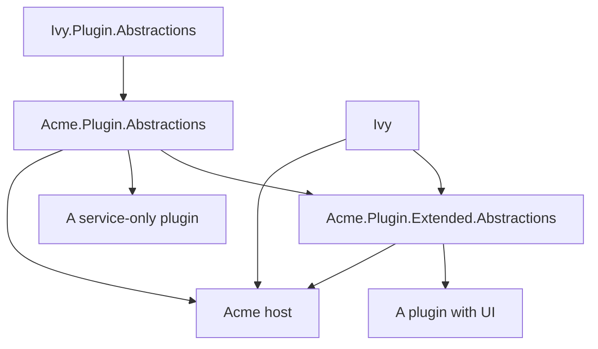

---
searchHints:
  - plugin
  - plugins
  - extensibility
  - plugin-host
  - iivyplugin
  - plugin-abstractions
  - assembly-load-context
---

# Plugins Overview

<Ingress>
Ivy gives you the machinery to load, configure, and unload plugins at runtime. As an application developer, you decide what a plugin is capable of.
</Ingress>

## What a Plugin Is

A plugin is a .NET class library, usually distributed as a NuGet package, with two things in it:

- one assembly-level `[IvyPlugin(typeof(T))]` attribute, and
- one type `T` implementing `IIvyPlugin`.

The host loads each plugin into its own collectible `AssemblyLoadContext`, so a plugin can be loaded, unloaded, and reloaded while the host keeps running. The plugin's own dependencies are resolved from its directory; the assemblies that form the *contract* between host and plugin are resolved from the host, so both sides see the same types.

That is the whole of what the framework defines. A plugin's capabilities — what it can register, what events it can handle, what your app lets it change — are yours to define.

## What the Framework Provides

Two packages, split by whether they need the Ivy framework itself.

### Ivy.Plugin.Abstractions

The base abstractions package. It does **not** reference `Ivy` — only `Microsoft.Extensions.DependencyInjection` and `Microsoft.Extensions.Logging.Abstractions`. It covers six concerns:

| Concern | Key types |
|---------|-----------|
| **The plugin contract** — what a plugin implements, and how the loader finds it | `IIvyPlugin`, `IIvyPlugin<TContext>`, `IvyPluginAttribute` |
| **What a plugin receives** — a service collection, and its own configuration | `IIvyPluginContext` |
| **Identity** — the id, title, icon, and minimum host version a plugin declares | `PluginManifest` |
| **Configuration** — the fields a plugin declares, and the store the host implements | `SchemaBuilder`, `IIvyPluginConfig`, `IIvyPluginConfigFactory` |
| **Lifecycle** — cleanup when a plugin is unloaded, reloaded, or the host exits | `PluginShutdownContext` |
| **The host's control surface** — load, unload, failure reasons, and resolving what plugins registered | `IPluginManager`, `IPluginServiceProvider` |

`IIvyPluginContext` is a small interface that consists of only a service collection and bag of user-provided config values:

```csharp
public interface IIvyPluginContext
{
    IServiceCollection Services { get; }
    IIvyPluginConfig Config { get; }
}
```

Almost everything a plugin contributes, it contributes through a contract *you* define on top of this.

### The Ivy Package

Plugins that choose to bring in the `Ivy` package, either directly or indirectly, gain access to three additional APIs which require the framework:

```csharp
public interface IIvyExtendedPluginContext : IIvyPluginContext
{
    // App registration
    void AddApp(AppDescriptor descriptor);
    void AddAppsFromAssembly(Assembly assembly);

    // HTTP endpoints
    void UseEndpoints(string slug, Action<IEndpointRouteBuilder> configure);
}
```

A plugin can register [apps](../10_Apps.md) and mount HTTP endpoints; that is the extent of Ivy's own plugin surface. Alongside it, `Ivy` provides `AsExtendedContext()` and `TryGetExtendedContext()` for plugins that only sometimes need framework features, and `MapStaticAssets` for serving files shipped with a plugin.

## Framework or Host

Plugin support in the framework is intended to be treated only as a foundation for you to design your own plugin system on top of. This split is deliberate and worth knowing before you design anything:

| Concern | Provided by |
|---------|-------------|
| Load, unload, and reload isolation | Framework |
| Entry-point discovery via `[IvyPlugin]` | Framework |
| Configuration schema, validation, and a generated settings form | Framework |
| Minimum-host-version and shared-assembly gating | Framework |
| Registering apps and HTTP endpoints from a plugin | Framework (`Ivy` package) |
| A built-in Plugin Manager app | Framework |
| **What a plugin can contribute to your app** | **Host** |
| **Where plugin configuration is stored** | **Host** |
| **Finding, installing, updating, and uninstalling plugins** | **Host** |
| **Your abstractions package and its versioning** | **Host** |

The framework stops where it does because a plugin contract is domain-specific. A messaging app wants channels; a CI tool wants build steps; a CRM wants record enrichers. Any contract rich enough to be useful to one of them would be wrong for the others. So the framework owns the parts that are genuinely universal (isolation, lifecycle, configuration, version gating) and hands you the rest.

<Callout Type="info">
This means for most practical purposes, your host should ship its own abstractions package(s), and plugin authors then reference *those*, not `Ivy.Plugin.Abstractions` directly. See [Host Abstractions](./03_HostAbstractions.md).
</Callout>

## How the Pieces Reference Each Other



A plugin compiles against your abstractions package. Your abstractions package compiles against the framework's. The host references both of your packages and declares them as shared, so the plugin and the host resolve your interfaces to the same types at runtime.

## Where to Go Next

- [Hosting Plugins](./02_HostingPlugins.md) — wire the loader into your [Server](../01_Program.md), store configuration, and declare your host-provided packages.
- [Host Abstractions](./03_HostAbstractions.md) — design the contract your plugins implement, and split it into base and extended packages.
- [Writing Plugins](./04_WritingPlugins.md) — what a plugin project looks like end to end.
- [Distributing Plugins](./05_DistributingPlugins.md) — discovery, installation, and updates.
- [Version Compatibility](./06_Compatibility.md) — keeping old plugins working against a newer host.

## See Also

- [Apps](../10_Apps.md)
- [Connections](../26_Connections.md)
- [External Widgets](../../../02_Widgets/07_Advanced/05_ExternalWidgets.md)
- [Program](../01_Program.md)
