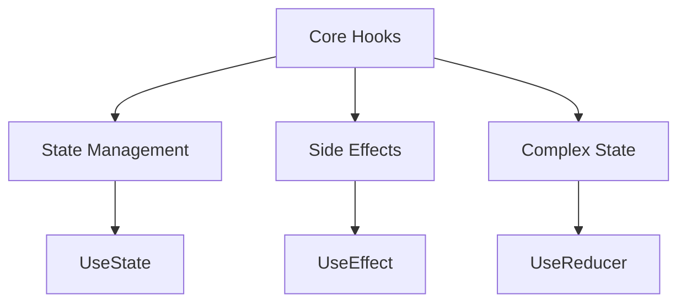
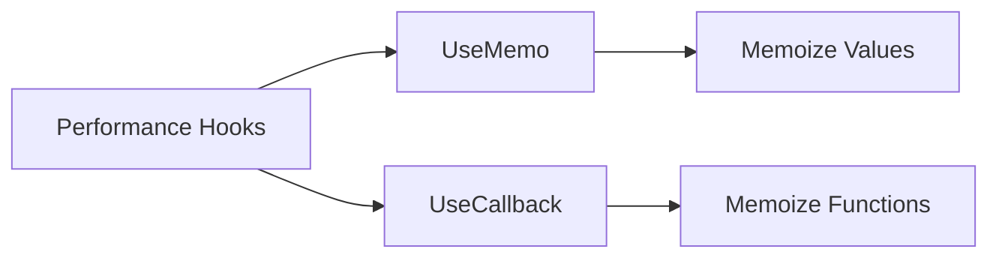
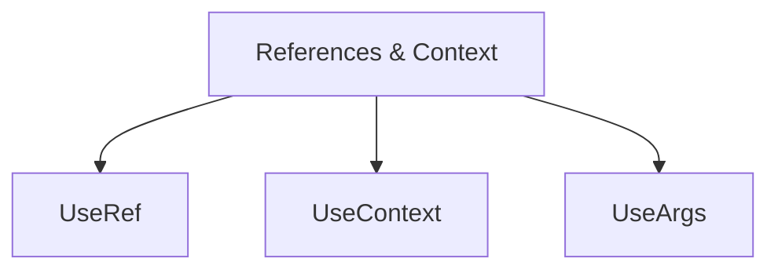
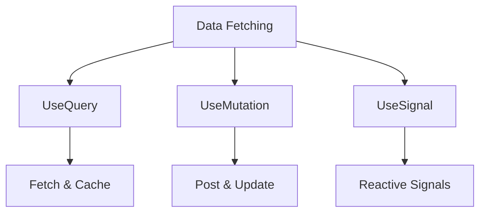
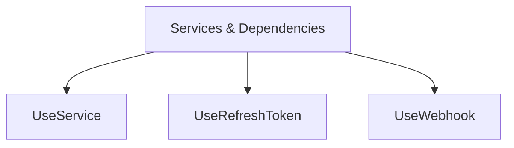
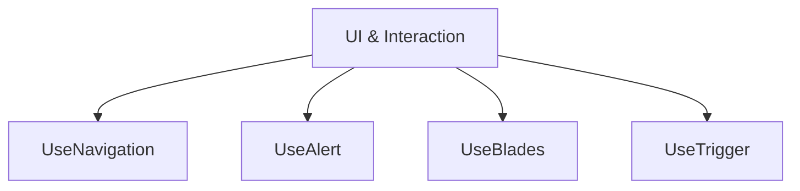
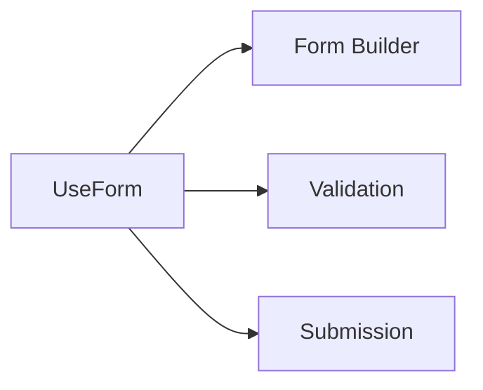
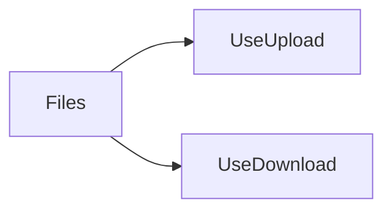

---
searchHints:
  - hooks
  - useState
  - useEffect
  - useQuery
  - state-management
  - lifecycle
  - reactivity
  - functional-components
---

# Hooks

<Ingress>
Discover the powerful functions that let you "hook into" Ivy state and lifecycle features - Hooks enable you to use state and side effects in your [Views](../../01_Onboarding/02_Concepts/02_Views.md) without writing class components.
</Ingress>

## Basic usage

Ivy provides a comprehensive set of hooks organized into several categories. All hooks follow the naming convention of starting with `Use` followed by an uppercase letter, and they must be called at the top level of your view's `Build` method:

```csharp demo-tabs
public class HooksDemo : ViewBase
{
    public override object? Build()
    {
        // State management
        var count = UseState(0);
        var name = UseState("World");
        
        // Side effects
        UseEffect(() => {
            Console.WriteLine($"Count changed to: {count.Value}");
        }, count);
        
        // Service access
        var client = UseService<IClientProvider>();
        
        return Layout.Vertical()
            | Text.H3($"Hello, {name.Value}!")
            | Text.P($"Count: {count.Value}")
            | Layout.Horizontal()
                | new Button("Increment", _ => count.Set(count.Value + 1))
                | new Button("Greet", _ => client.Toast($"Hello, {name.Value}!"))
            | name.ToTextInput().Placeholder("Enter your name");
    }
}
```

### Hook Library

Ivy ships with a comprehensive set of hooks organized by purpose:

| Category                     | Hooks                                                                                                                                     |
| ---------------------------- | ----------------------------------------------------------------------------------------------------------------------------------------- |
| **Core**                     | [UseState](./Core/03_UseState.md), [UseEffect](./Core/04_UseEffect.md), [UseReducer](./Core/07_UseReducer.md)                            |
| **Performance**              | [UseMemo](./Core/05_UseMemo.md), [UseCallback](./Core/06_UseCallback.md)                                                                 |
| **References & Context**     | [UseRef](./Core/08_UseRef.md), [UseContext](./Core/12_UseContext.md), [UseArgs](./Core/13_UseArgs.md)                                     |
| **Data Fetching**            | [UseQuery](./Core/09_UseQuery.md), [UseMutation](./Core/14_UseMutation.md), [UseSignal](./Core/10_UseSignal.md)                           |
| **Services & Dependencies**  | [UseService](./Core/11_UseService.md), [UseRefreshToken](./Core/16_UseRefreshToken.md), [UseWebhook](./Core/19_UseWebhook.md)            |
| **UI & Interaction**         | [UseNavigation](./Core/23_UseNavigation.md), [UseAlert](./Core/24_UseAlert.md), [UseBlades](./Core/21_UseBlades.md), [UseTrigger](./Core/17_UseTrigger.md)  |
| **Forms**                    | [UseForm](./Core/22_UseForm.md)                                                                                                             |
| **Files**                    | [UseUpload](./Core/18_UseUpload.md), [UseDownload](./Core/15_UseDownload.md)                                                              |

### Core Hooks

Core hooks provide the fundamental building blocks for state management and side effects in your views.



#### UseState

Manage local component state that triggers re-renders when updated:

```csharp demo-tabs
public class StateDemo : ViewBase
{
    public override object? Build()
    {
        var count = UseState(0);
        var text = UseState("");
        var active = UseState(false);
        
        return Layout.Vertical().Gap(4)
            | Text.H3($"Count: {count.Value}")
            | Layout.Horizontal()
                | new Button("+", _ => count.Set(count.Value + 1))
                | new Button("-", _ => count.Set(count.Value - 1))
            | text.ToTextInput().Placeholder("Enter text...")
            | Text.P($"You typed: {text.Value}")
            | active.ToSwitchInput().Label("Toggle switch");
    }
}
```

**Key Features:**

- Type-safe state management with `IState<T>`
- Automatic re-renders on state changes
- Support for any type (primitives, objects, collections)
- Lazy initialization with factory functions

See [UseState](./Core/03_UseState.md) for detailed documentation.

#### UseEffect

Perform side effects with dependency tracking, similar to React's useEffect:

```csharp demo-tabs
public class EffectDemo : ViewBase
{
    public override object? Build()
    {
        var count = UseState(0);
        var client = UseService<IClientProvider>();
        
        // Run on mount
        UseEffect(() => {
            client.Toast("Component mounted!");
        }, EffectTrigger.OnMount());
        
        // Run when count changes
        UseEffect(() => {
            Console.WriteLine($"Count is now: {count.Value}");
        }, count);
        
        return Layout.Vertical()
            | Text.P($"Count: {count.Value}")
            | new Button("Increment", _ => count.Set(count.Value + 1));
    }
}
```

**Key Features:**

- Run effects on mount, state changes, or every render
- Cleanup functions for resource management
- Async effect support
- Dependency tracking for optimal performance

See [UseEffect](./Core/04_UseEffect.md) for detailed documentation.

#### UseReducer

Manage complex state logic with reducers for predictable state updates:

```csharp demo-tabs
public class ReducerDemo : ViewBase
{
    private record CounterState(int Count);
    
    private CounterState CounterReducer(CounterState state, string action) => action switch
    {
        "increment" => state with { Count = state.Count + 1 },
        "decrement" => state with { Count = state.Count - 1 },
        "reset" => new CounterState(0),
        _ => state
    };
    
    public override object? Build()
    {
        var (state, dispatch) = UseReducer(CounterReducer, new CounterState(0));
        
        return Layout.Vertical().Gap(2)
            | Text.H3($"Count: {state.Count}")
            | Layout.Horizontal()
                | new Button("Increment", _ => dispatch("increment"))
                | new Button("Decrement", _ => dispatch("decrement"))
                | new Button("Reset", _ => dispatch("reset"));
    }
}
```

**Key Features:**

- Centralized state update logic
- Predictable state transitions
- Ideal for complex state machines
- Type-safe action dispatching

See [UseReducer](./Core/07_UseReducer.md) for detailed documentation.

### Performance Hooks

Optimize rendering performance with memoization hooks:



#### UseMemo

Memoize expensive calculations to avoid recomputation on every render:

```csharp demo-tabs
public class MemoDemo : ViewBase
{
    public override object? Build()
    {
        var items = UseState(new[] { 1, 2, 3, 4, 5 });
        var filter = UseState("");
        
        var filteredItems = UseMemo(() => 
            items.Value.Where(x => x.ToString().Contains(filter.Value)).ToArray(),
            items, filter
        );
        
        return Layout.Vertical().Gap(2)
            | filter.ToTextInput().Placeholder("Filter numbers...")
            | Text.P($"Filtered count: {filteredItems.Length}")
            | Layout.Vertical(filteredItems.Select(x => Text.P(x.ToString())).ToArray());
    }
}
```

**Key Features:**

- Recompute only when dependencies change
- Reduce unnecessary calculations
- Improve render performance
- Type-safe dependency tracking

See [UseMemo](./Core/05_UseMemo.md) for detailed documentation.

#### UseCallback

Memoize callback functions to prevent unnecessary re-renders:

```csharp demo-tabs
public class CallbackDemo : ViewBase
{
    public override object? Build()
    {
        var count = UseState(0);
        
        var handleClick = UseMemo(() => (Action)(() => {
            count.Set(count.Value + 1);
        }), count);
        
        return Layout.Vertical()
            | Text.P($"Count: {count.Value}")
            | new Button("Increment", _ => handleClick());
    }
}
```

**Key Features:**

- Stable function references
- Prevent child component re-renders
- Optimize component composition
- Dependency-based memoization

See [UseCallback](./Core/06_UseCallback.md) for detailed documentation.

### References & Context

Access DOM-like references, share context, and read view arguments:



#### UseRef

Store mutable values that don't trigger re-renders:

```csharp demo-tabs
public class RefDemo : ViewBase
{
    private class Counter { public int Value = 0; }
    
    public override object? Build()
    {
        var count = UseState(0);
        var renderCount = UseRef(() => new Counter());
        
        renderCount.Value.Value++;
        
        return Layout.Vertical()
            | Text.P($"Count: {count.Value}")
            | Text.P($"Renders: {renderCount.Value.Value}")
            | new Button("Increment", _ => count.Set(count.Value + 1));
    }
}
```

**Key Features:**

- Mutable values without re-renders
- Store component instance values
- Access previous values
- Imperative API access

See [UseRef](./Core/08_UseRef.md) for detailed documentation.

#### UseContext

Access shared context values across component trees:

```csharp demo-tabs
public class ContextProvider : ViewBase
{
    public override object? Build()
    {
        var count = UseState(0);
        
        // Create context for child components
        CreateContext(() => count.Value);
        
        return Layout.Vertical()
            | Text.P($"Parent count: {count.Value}")
            | new Button("Increment", _ => count.Set(count.Value + 1))
            | new ChildView();
    }
}

public class ChildView : ViewBase
{
    public override object? Build()
    {
        var count = UseContext<int>();
        return Text.P($"Count from context: {count}");
    }
}
```

**Key Features:**

- Share values across components
- Avoid prop drilling
- Type-safe context access
- Provider/consumer pattern

See [UseContext](./Core/12_UseContext.md) for detailed documentation.

#### UseArgs

Read arguments passed to views:

```csharp demo-tabs
public record ArgsDemoArgs(string Message, int Count);

public class ArgsDemo : ViewBase
{
    public override object? Build()
    {
        var args = UseArgs<ArgsDemoArgs>();
        
        return Layout.Vertical()
            | Text.P($"Message: {args?.Message ?? "No message"}")
            | Text.P($"Count: {args?.Count ?? 0}");
    }
}
```

**Key Features:**

- Access view arguments
- Type-safe argument reading
- Tuple argument support
- Optional argument handling

See [UseArgs](./Core/13_UseArgs.md) for detailed documentation.

### Data Fetching

Fetch, cache, and synchronize server data with powerful data fetching hooks:



#### UseQuery

Fetch and cache asynchronous data with automatic revalidation:

```csharp demo-tabs
public class QueryDemo : ViewBase
{
    public override object? Build()
    {
        var query = UseQuery(
            key: "user-data",
            fetcher: async ct => {
                await Task.Delay(1000, ct);
                return new { Name = "Alice", Email = "alice@example.com" };
            }
        );
        
        if (query.Loading) return Text.P("Loading...");
        if (query.Error != null) return Text.P($"Error: {query.Error.Message}");
        
        return Layout.Vertical()
            | Text.P($"Name: {query.Value?.Name}")
            | Text.P($"Email: {query.Value?.Email}")
            | new Button("Refetch", _ => query.Mutator.Revalidate());
    }
}
```

**Key Features:**

- Automatic caching and revalidation
- Loading and error states
- Background data synchronization
- Optimistic updates support
- SWR-inspired API

See [UseQuery](./Core/09_UseQuery.md) for detailed documentation.

#### UseMutation

Control query caches and perform optimistic updates:

```csharp demo-tabs
public class MutationDemo : ViewBase
{
    public override object? Build()
    {
        // Control a query cache
        var mutator = UseMutation("user-data");
        
        return Layout.Vertical().Gap(2)
            | new Button("Refresh", _ => mutator.Revalidate())
            | new Button("Clear Cache", _ => mutator.Invalidate());
    }
}
```

**Key Features:**

- Handle mutation operations
- Loading and error states
- Optimistic updates
- Automatic query invalidation
- Type-safe mutations

See [UseMutation](./Core/14_UseMutation.md) for detailed documentation.

#### UseSignal

Create reactive signals for cross-component communication:

```csharp demo-tabs
public class CounterSignal : AbstractSignal<int, string> { }

public class SignalExample : ViewBase
{
    public override object? Build()
    {
        var signal = CreateSignal<CounterSignal, int, string>();
        var output = UseState("");

        async ValueTask OnClick(Event<Button> _)
        {
            var results = await signal.Send(1);
            output.Set(string.Join(", ", results));
        }

        return Layout.Vertical(
            new Button("Send Signal", OnClick),
            new ChildReceiver(),
            output.Value
        );
    }
}

public class ChildReceiver : ViewBase
{
    public override object? Build()
    {
        var signal = UseSignal<CounterSignal, int, string>();
        var counter = UseState(0);

        UseEffect(() => signal.Receive(input =>
        {
            counter.Set(counter.Value + input);
            return $"Child received: {input}, total: {counter.Value}";
        }));

        return new Card($"Counter: {counter.Value}");
    }
}
```

**Key Features:**

- Cross-component communication
- Event-like behavior
- Type-safe signal emission
- Subscription management

See [UseSignal](./Core/10_UseSignal.md) for detailed documentation.

### Services & Dependencies

Integrate with dependency injection and external services:



#### UseService

Access services from the dependency injection container:

```csharp demo-tabs
public class ServiceDemo : ViewBase
{
    public override object? Build()
    {
        var client = UseService<IClientProvider>();
        var count = UseState(0);
        
        UseEffect(() => {
            Console.WriteLine($"Count changed to {count.Value}");
        }, count);
        
        return Layout.Vertical()
            | Text.P($"Count: {count.Value}")
            | new Button("Increment", _ => count.Set(count.Value + 1))
            | new Button("Show Toast", _ => client.Toast($"Count is {count.Value}"));
    }
}
```

**Key Features:**

- Access any registered service
- Type-safe service resolution
- Scoped service lifetime
- Integration with DI container

See [UseService](./Core/11_UseService.md) for detailed documentation.

#### UseRefreshToken

Manually trigger UI updates and effect executions:

```csharp demo-tabs
public class RefreshTokenDemo : ViewBase
{
    public override object? Build()
    {
        var refreshToken = UseRefreshToken();
        var timestamp = UseState(DateTime.Now);
        
        UseEffect(() => {
            timestamp.Set(DateTime.Now);
        }, refreshToken);
        
        return Layout.Vertical()
            | Text.P($"Last refreshed: {timestamp.Value:HH:mm:ss}")
            | new Button("Refresh", _ => refreshToken.Refresh());
    }
}
```

**Key Features:**

- Automatic token refresh
- Token expiration handling
- Secure token management
- Integration with HTTP clients

See [UseRefreshToken](./Core/16_UseRefreshToken.md) for detailed documentation.

#### UseWebhook

Create HTTP endpoints for external systems:

```csharp demo-tabs
public class WebhookDemo : ViewBase
{
    public override object? Build()
    {
        var counter = UseState(0);
        var webhook = UseWebhook(_ => {
            counter.Set(counter.Value + 1);
        });
        
        return Layout.Vertical()
            | Text.P($"Webhook called {counter.Value} times")
            | Text.Code(webhook.GetUri().ToString());
    }
}
```

**Key Features:**

- Real-time webhook subscriptions
- Event-driven updates
- Automatic connection management
- Type-safe event handling

See [UseWebhook](./Core/19_UseWebhook.md) for detailed documentation.

### UI & Interaction

Build interactive UIs with navigation, alerts, blades, and triggers:



#### UseNavigation

Handle navigation and routing in your application:

```csharp demo-tabs
public class NavigationDemo : ViewBase
{
    public override object? Build()
    {
        var navigation = UseNavigation();
        
        return Layout.Vertical().Gap(2)
            | Layout.Horizontal()
                | new Button("Navigate by URI", _ => navigation.Navigate("app://hooks/core/usestate"))
                | new Button("Navigate by Type", _ => navigation.Navigate(typeof(NavigationDemo)))
                | new Button("Open External", _ => navigation.Navigate("https://docs.ivy.app"));
    }
}
```

**Key Features:**

- Programmatic navigation
- History management
- Route parameter access
- Type-safe routing

See [UseNavigation](./Core/23_UseNavigation.md) for detailed documentation.

#### UseAlert

Display alert dialogs to users:

```csharp demo-tabs
public class AlertDemo : ViewBase
{
    public override object? Build()
    {
        var (alertView, showAlert) = UseAlert();
        
        return Layout.Vertical().Gap(2)
            | new Button("Show Alert", _ => 
                showAlert("Are you sure you want to continue?", result => {
                    Console.WriteLine($"User selected: {result}");
                }, "Alert Title"))
            | alertView;
    }
}
```

**Key Features:**

- Alert dialogs
- Confirmation dialogs
- Input prompts
- Async dialog handling

See [UseAlert](./Core/24_UseAlert.md) for detailed documentation.

#### UseBlades

Create side panel interfaces with blade navigation:

```csharp demo-tabs
public class BladeNavigationDemo : ViewBase
{
    public override object? Build()
    {
        return UseBlades(() => new NavigationRootView(), "Home");
    }
}

public class NavigationRootView : ViewBase
{
    public override object? Build()
    {
        var blades = UseContext<IBladeService>();
        var index = blades.GetIndex(this);

        return Layout.Horizontal().Height(Size.Units(50))
        | (Layout.Vertical()
            | Text.Block($"This is blade level {index}")
            | new Button($"Push Blade {index + 1}", onClick: _ =>
                blades.Push(this, new NavigationRootView(), $"Level {index + 1}"))
            | new Button($"Push Wide Blade", onClick: _ =>
                blades.Push(this, new NavigationRootView(), $"Wide Level {index + 1}", width: Size.Units(100)))
            | (index > 0 ? new Button("Go Back", onClick: _ => blades.Pop()) : null));
    }
}
```

**Key Features:**

- Side panel navigation
- Blade stack management
- Push/pop navigation
- Context-aware blades

See [UseBlades](./Core/21_UseBlades.md) for detailed documentation.

#### UseTrigger

Create triggerable components for modals and dialogs:

```csharp demo-tabs
public class SimpleTriggerExample : ViewBase
{
    public override object? Build()
    {
        var (triggerView, showTrigger) = UseTrigger((IState<bool> isOpen) =>
            isOpen.Value ? new ModalDialog(isOpen) : null);

        return Layout.Vertical()
            | new Button("Show Modal", onClick: _ => showTrigger())
            | triggerView;
    }
}

public class ModalDialog(IState<bool> isOpen) : ViewBase
{
    public override object? Build()
    {
        return Layout.Vertical()
            | Text.Block("This is a modal dialog")
            | new Button("Close", onClick: _ => isOpen.Set(false));
    }
}
```

**Key Features:**

- Externally triggerable actions
- Trigger counting
- Reset capability
- Integration with events

See [UseTrigger](./Core/17_UseTrigger.md) for detailed documentation.

### Forms

Handle complex form state and validation:



#### UseForm

Manage form state, validation, and submission:

```csharp demo-tabs
public record UserModel(string Name, string Email, int Age);

public class FormDemo : ViewBase
{
    public override object? Build()
    {
        var user = UseState(() => new UserModel("", "", 25));
        var (onSubmit, formView, validationView, loading) = UseForm(() => user.ToForm()
            .Required(m => m.Name, m => m.Email));
        
        async ValueTask HandleSubmit()
        {
            if (await onSubmit())
            {
                Console.WriteLine($"Submitted: {user.Value.Name}, {user.Value.Email}, {user.Value.Age}");
            }
        }
        
        return Layout.Vertical().Gap(4)
            | formView
            | validationView
            | new Button("Submit", _ => HandleSubmit())
                .Primary()
                .Disabled(loading)
                .Loading(loading);
    }
}
```

**Key Features:**

- Comprehensive form state management
- Built-in validation
- Type-safe form builders
- Custom layouts support
- Loading and error states

See [UseForm](./Core/22_UseForm.md) for detailed documentation.

### Files

Handle file uploads and downloads:



#### UseUpload

Handle file uploads with progress tracking:

```csharp demo-tabs
public class UploadDemo : ViewBase
{
    public override object? Build()
    {
        var fileState = UseState<FileUpload<byte[]>?>();
        var upload = UseUpload(MemoryStreamUploadHandler.Create(fileState));
        
        return Layout.Vertical()
            | fileState.ToFileInput(upload).Placeholder("Choose file...")
            | (fileState.Value != null ? Text.P($"File: {fileState.Value.FileName}") : null);
    }
}
```

**Key Features:**

- File selection and upload
- Progress tracking
- Multiple file support
- Type-safe upload handlers

See [UseUpload](./Core/18_UseUpload.md) for detailed documentation.

#### UseDownload

Trigger file downloads:

```csharp demo-tabs
public class DownloadDemo : ViewBase
{
    public override object? Build()
    {
        var content = UseState("Hello, World!");
        var downloadUrl = UseDownload(
            factory: () => System.Text.Encoding.UTF8.GetBytes(content.Value),
            mimeType: "text/plain",
            fileName: "hello.txt"
        );
        
        var jsonContent = UseState("""{"name": "Ivy", "version": "1.0"}""");
        var jsonUrl = UseDownload(
            factory: () => System.Text.Encoding.UTF8.GetBytes(jsonContent.Value),
            mimeType: "application/json",
            fileName: "data.json"
        );
        
        return Layout.Vertical()
            | (downloadUrl.Value != null 
                ? new Button("Download File").Url(downloadUrl.Value) 
                : Text.P("Preparing download..."))
            | (jsonUrl.Value != null 
                ? new Button("Download JSON").Url(jsonUrl.Value) 
                : Text.P("Preparing download..."));
    }
}
```

**Key Features:**

- Programmatic file downloads
- Custom file names and types
- Support for various content types
- Browser download integration

See [UseDownload](./Core/15_UseDownload.md) for detailed documentation.

## Best Practices

1. **Call Hooks at Top Level** - Always call hooks at the top level of your `Build` method, never inside loops, conditions, or nested functions. See [Rules of Hooks](./02_RulesOfHooks.md) for details.

2. **Use Appropriate Hooks** - Choose the right hook for your use case:
   - `UseState` for simple local state
   - `UseReducer` for complex state logic
   - `UseQuery` for server data fetching
   - `UseMemo`/`UseCallback` for performance optimization

3. **Handle Loading States** - Always handle loading and error states when using async hooks like `UseQuery` and `UseMutation`.

4. **Clean Up Effects** - Return cleanup functions from `UseEffect` to prevent memory leaks and cancel ongoing operations.

5. **Custom Hooks** - Extract reusable hook logic into custom hooks following the `UseX` naming convention.

## Creating Custom Hooks

You can build your own hooks to reuse stateful logic between components. A custom hook is a function whose name starts with "Use" and that may call other hooks:

```csharp
public static IState<string> UseLocalStorage(string key, string defaultValue)
{
    var state = UseState(defaultValue);
    
    UseEffect(() => {
        var stored = localStorage.GetItem(key);
        if (stored != null) state.Set(stored);
    }, EffectTrigger.OnMount());
    
    UseEffect(() => {
        localStorage.SetItem(key, state.Value);
    }, state);
    
    return state;
}
```

## See Also

- [Rules of Hooks](./02_RulesOfHooks.md) - Essential rules for using hooks correctly
- [Views](../../01_Onboarding/02_Concepts/02_Views.md) - Understanding Ivy Views
- [Forms](../../01_Onboarding/02_Concepts/04_Forms.md) - Working with forms in Ivy
- [UseService](./Core/11_UseService.md) - Dependency injection and services
