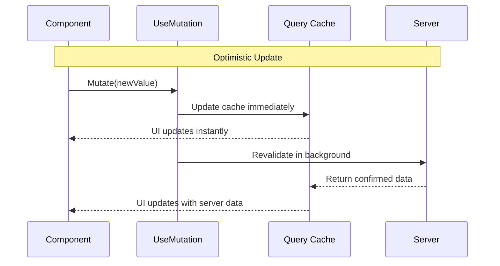

---
searchHints:
  - mutation
  - usemutation
  - query-mutation
  - data-mutation
  - update
  - invalidate
---

# UseMutation

<Ingress>
The `UseMutation` [hook](../02_RulesOfHooks.md) provides a way to control [query](./09_UseQuery.md) caches from different components, enabling optimistic updates, cache invalidation, and cross-component data synchronization.
</Ingress>

## Overview

`UseMutation` enables you to control query caches irrespective of where they are used. It supports:

- **Optimistic Updates**: Update cache immediately before server confirmation.
- **Cross-Component Control**: Trigger updates from components that don't consume the data.
- **Background Revalidation**: Refresh data without clearing the current cache.

### Mutation Flow



## API

The hook returns a `QueryMutator` object. Use the typed generic version for optimistic updates.

```csharp
// Typed (Recommended for optimistic updates)
var mutator = UseMutation<User, string>("user-profile");

// Untyped (Good for simple invalidation)
var mutator = UseMutation("user-profile");
```

### Methods

| Method | Description | Usage |
|--------|-------------|-------|
| `Mutate(value, revalidate)` | Updates cache immediately with `value`. If `revalidate` is true, triggers a background fetch after. | Optimistic UI updates (e.g., Like button). |
| `Revalidate()` | Triggers a background refresh. Keeps showing stale data until new data arrives. | Non-destructive updates (e.g., Edit form save). |
| `Invalidate()` | Clears the cache and forces a refetch. UI enters "switching" or "loading" state. | Destructive operations (e.g., Delete item). |

## Examples

### Optimistic Updates

Update the UI immediately while the server processes the request.

```csharp
public class LikeButton : ViewBase
{
    public override object? Build()
    {
        var postId = 123;
        // Typed mutator is required for Mutate()
        var mutator = UseMutation<Post, int>($"post-{postId}");
        var query = UseQuery($"post-{postId}", ...);

        return new Button("Like", _ => 
        {
            var current = query.Value;
            var optimized = current with { Likes = current.Likes + 1, IsLiked = true };

            // 1. Update UI immediately
            mutator.Mutate(optimized, revalidate: true);

            // 2. Perform actual API call
            _ = Api.LikePost(postId); 
        });
    }
}
```

### Form Submission

Update data locally then sync with server.

```csharp
public class UserForm : ViewBase
{
    public override object? Build()
    {
        var name = UseState("");
        var mutator = UseMutation<User, string>("user-profile");

        return Layout.Vertical(
            name.ToTextInput("Name"),
            new Button("Save", async _ => 
            {
                // Optimistic update
                mutator.Mutate(new User { Name = name.Value }, revalidate: true);
                
                // Actual save
                await Api.SaveUser(name.Value);
            })
        );
    }
}
```

### Shared Control (Cross-Component)

Control a query from a completely separate component (e.g., a header button controlling a list).

```csharp
public class RefreshHeader : ViewBase
{
    public override object? Build()
    {
        // No UseQuery here, just the mutator
        var mutator = UseMutation("dashboard-stats");

        return Layout.Horizontal(
            new Button("Refresh", _ => mutator.Revalidate()),
            new Button("Force Reload", _ => mutator.Invalidate())
        );
    }
}
```

## Query Scopes

`UseMutation` supports the same scopes as `UseQuery`, **except `View` scope**.

| Scope | Support | Reason |
|-------|---------|--------|
| `Server`, `App`, `Device` | ✅ Supported | Shared state can be accessed by key. |
| `View` | ❌ Not Supported | View-scoped queries are isolated to a specific component instance and cannot be targeted externally. |

## Best Practices & Troubleshooting

*   **Keys Must Match Exactly**: "user-data" and "User-Data" are different keys.
*   **Use Typed Mutations**: You cannot call `Mutate(value)` on an untyped `UseMutation("key")`. You must provide types: `UseMutation<T, TKey>("key")`.
*   **Revalidate vs Invalidate**:
    *   Use **Revalidate** when you want to keep showing the current data while updating (e.g., "Refresh" button).
    *   Use **Invalidate** when the current data is definitely wrong or deleted (e.g., "Delete" button).

<Callout type="Warning">
    If your mutation isn't working, check if the target `UseQuery` is using <code>Scope = QueryScope.View</code>. UseMutation cannot see View-scoped queries.
</Callout>

## See Also

- [UseQuery](./09_UseQuery.md)
- [Rules of Hooks](../02_RulesOfHooks.md)
