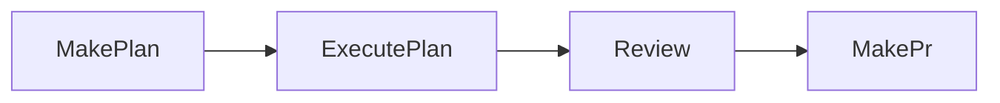

---
searchHints:
  - overview
  - what-is
  - tendril
  - agent
  - orchestration
  - architecture
icon: Rocket
---

# Welcome to Tendril

<Ingress>
Tendril is an AI orchestration app on the Ivy stack: a cross-platform UI plus autonomous agents for real software workflows—not a black box.
</Ingress>

<Embed Url="https://youtu.be/Gkj5aj5nEKA"/>

<Callout type="tip">
You can always report issues and suggestions on the [GitHub repository](https://github.com/Ivy-Interactive/Ivy-Framework/issues).
If you need direct help, please join our [Discord](https://discord.gg/FHgxkDga3y).
</Callout>

You see each stage of the work. Tasks are **Plans**; orchestrated **Promptwares** (Claude-based agents) generate code, verify it, and open PRs—without hiding what ran.

## The Concept

**Plans** are structured units of work (bugfix, refactor, feature). Tendril moves them through a lifecycle using single-purpose agents called **Promptwares**.

## Key features

| Area | What it does |
|------|----------------|
| **Plan lifecycle** | Draft – execution – review – PR. |
| **Multi-project** | Several repos; per-project verification rules. |
| **Jobs** | Status, tokens, cost per run. |
| **Promptwares** | e.g. `MakePlan`, `ExecutePlan`, `ExpandPlan`, `MakePr`. |
| **Git worktrees** | Agent work stays off your main branch. |
| **Terminal & files** | Embedded terminal (Claude Code) and local file access. |
| **Verification** | Your build, test, and format checks. |

## The Tendril loop

Work is a **pipeline**, not one chat reply. Each step is a **job** (status, logs, tokens, cost).

**ExpandPlan** can run after **MakePlan** to split or deepen work—it is optional and not shown in the diagram above.

| Step | Promptware | Role |
|------|------------|------|
| 1 | **MakePlan** | Brief or issue – structured plan. |
| 2 | **ExpandPlan** | Split a large plan into smaller chunks (optional). |
| 3 | **ExecutePlan** | Implement in a **worktree**; run **verifications** until green. |
| 4 | **Review** | You approve, suggest changes, or discard. |
| 5 | **MakePr** | Open a **GitHub PR** from the result. |

Below, each step matches how you use it in the UI (good anchors for screenshots).

### MakePlan

Start from a short description, an issue, or **Drafts** / **Inbox**. **MakePlan** outputs problem, solution, tests, and verification commands. Nothing runs yet—you get an editable draft.

When you **Create New Plan** in the UI, the dialog uses three fields:

| Field | What to know |
|-------|----------------|
| **Select project(s)** | **Auto** or one+ **named projects** (from `TENDRIL_HOME/config.yaml`, same as **Settings – Projects**). **Auto** and named picks are mutually exclusive. |
| **Priority** | **Normal**, **High**, **Urgent**—used to **order jobs** when several plans queue. |
| **Describe the task** | Free text (“Enter task description…”). **MakePlan** turns it into the structured plan. |

### ExecutePlan

After **Create**, work appears as **Jobs** in the sidebar: one row per promptware run. The list is live—not a hidden background task.

Each row shows **status**, linked **plan** id, **prompt/title**, **type** (`MakePlan`, `ExecutePlan`, `MakePr`, …), **project**, timing, **cost** and **tokens**, and a short **message**. The list header summarizes overall progress. **Row actions** (right) open the plan, job output (**JSON** where relevant), full prompt, **stop**, refresh, and trash. Details: [Jobs](../04_Apps/04_Jobs.md).

**ExecutePlan** applies changes in an isolated **worktree**. It runs your **build / format / test** steps and retries on failure. Logs stream into the job.

### Drafts

**Drafts** is the screen for plans still in **Draft** (or **Blocked**): you read the latest revision (problem, solution, tests) on tabs like **Plan**, **Summary**, and **Verifications**, and you can keep it open while jobs run—watch **Jobs** for live output and return here as the revision and status update.

Use **Execute** to run **ExecutePlan** in a worktree, **Update** to feed text and run **UpdatePlan**, **Split** / **Expand** for **SplitPlan** / **ExpandPlan**, or **Delete** to drop the draft. More: [Drafts](../04_Apps/03_Drafts.md).

### Review

Open **Review** for **Ready for review** and **Failed** plans. Pick a plan in the sidebar (search and filters). Inspect or **Rerun** failures.

<Callout type="warning">
**Yolo on all repos:** **Make PR** starts **MakePr** immediately—often auto-merge per automation. Prefer **⋯ – Custom PR** for the full dialog first. **Any repo not yolo:** **Make PR** already opens **Custom PR**.
</Callout>

### MakePr

**MakePr** creates a **GitHub PR** from the plan’s worktree (`gh`, your configured repo). It stays linked to the same plan and jobs.

**Custom PR** (when **Make PR** doesn’t skip straight to the job, or via **⋯ – Custom PR**) lets you turn on **Merge** (request auto-merge, subject to GitHub rules), **Delete branch** after merge (only when **Merge** is on), **Include artifacts**, an optional **Assignee**, and a **Comment**—that comment is the **PR body** on GitHub.

That loop turns the assistant from autocomplete into something you can ship with.

### What stays on disk (after the loop)

**Onboarding** picks your data directory. That path is **`TENDRIL_HOME`** (env + tools). Everything below lives there—not inside the git repo as scattered files.

| At `TENDRIL_HOME` | Examples |
|-------------------|----------|
| Config | `config.yaml`, backups |
| Work areas | **Plans**, **Inbox**, **Trash** |
| Tooling | **Promptwares**, **Hooks** |
| Other | e.g. `crash.log` |

Each plan: `TENDRIL_HOME/Plans/00042-ShortTitle/`. That folder holds `plan.yaml`, **revisions**, **verification** output, job logs under `logs/` (Markdown, e.g. `001-ExecutePlan.md`), token/cost rollups in `costs.csv`, and **worktrees** for the code. Treat plans like normal folders: diff, grep, backup. The UI reads the same files.

States and layout: [Plans](../02_Concepts/01_Plans.md), [Lifecycle & Jobs](../02_Concepts/03_Lifecycle.md).
